# Git gud

This is the first chapter in a series of 10 of the
[learn.rb project](https://github.com/monorkin/learn.rb) whose goal is to teach
people Ruby with a focus on Ruby on Rails.

## Chapters

1. [Introduction](#introduction)
2. [Terminal emulator](#terminal-emulator)
3. [Text editor](#text-editor)
4. [Git version tracker](#git-version-tracker)
5. [Working with Git](#working-with-git)
6. [Ruby runtime](#ruby-runtime)
7. [Assignment](#assignment)

## Introduction

The goal of this introduction chapter is to get you up and running with the
tools that we'll need to finish this course.

Please note that this project focuses on *nix operating systems, meaning
that Linux and Mac users will have a much easier time following it than
Windows users. This doesn't mean that examples for Windows users won't be given
just that some examples may not work out-of-the-box and the guide could have
discrepancies regarding software installation. Some of this issues can be
resolved by installing [Linux subsystem for Windows](https://docs.microsoft.com/en-us/windows/wsl/install-win10)
and your favorite Linux distribution from the Microsoft store.

Now, with the disclaimers out of the way, we can finally begin!

For this course we'll need four basic tools:
1. A terminal emulator
2. A text editor
3. The Git version tracker
4. The Ruby runtime

Let's take each tool and explain why we need it.

## Terminal emulator

Most programmers still to this day honor standards that were set in the 80's and
70's, because of that we to this day still use terminals to interact with all
programs we write.

Back in the 70's and 80's computers didn't have enough processing power to
render a full desktop with icons and run programs at the same time. Therefore
people used terminals to interact with the computer.

A terminal is basically a digital typewriter. You type in commands that the
computer executes and then it prints the result on screen.


As computers were extremely expensive back-in-the-day, terminals were built
down to a cost meaning that they had just enough processing power to render
the text on screen, the heavy lifting / computing was done by a mainframe
computer the terminal was attached to.


Therefore, most computer scientists and programmers used terminals to program
the mainframes and run programs. As terminals have been standardised and as
they are an operating system agnostic way to run and write programs, and as
they can connect to any computer to run software they are in wide use to this
day.

Every operating system ships with a terminal emulator. A program that emulates
the behaviour of the old-school terminals. So that you can run and interact with
software on your or another computer through it.

On most Linux systems the terminal emulator is called Terminal, as well as on
Mac, while on Windows the terminal emulator is called cmd.exe.

Any built-in terminal will be more than sufficient for this course.

So let's fire it up and do a couple of examples!

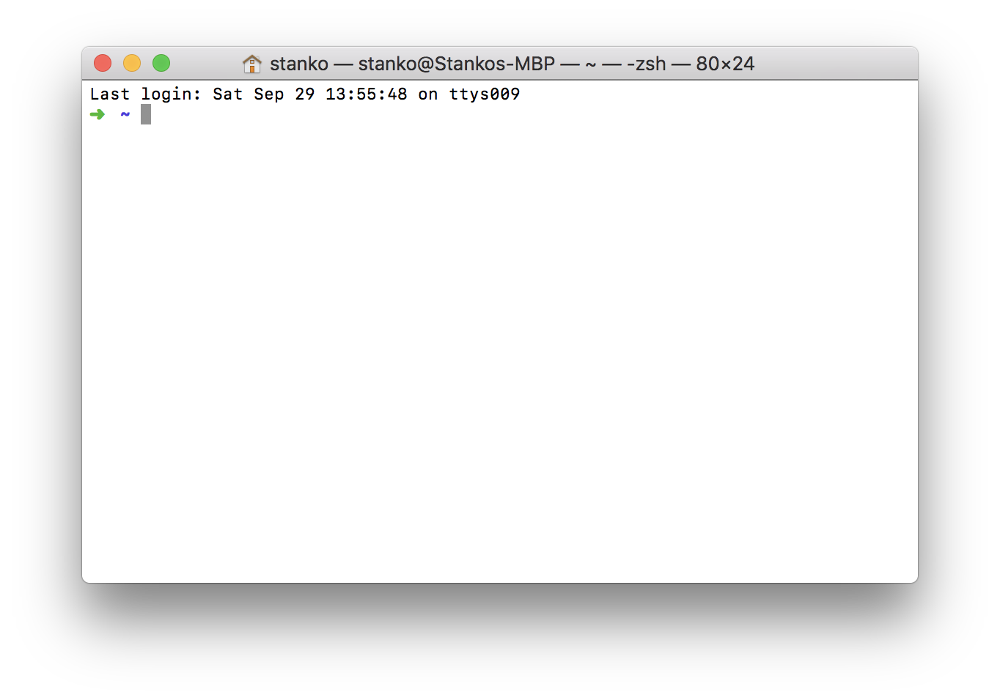

We can ask our computer to print out a message for us using the `echo` command.
For example `echo "Hello World"` will print out the words "Hello World" on
the screen.

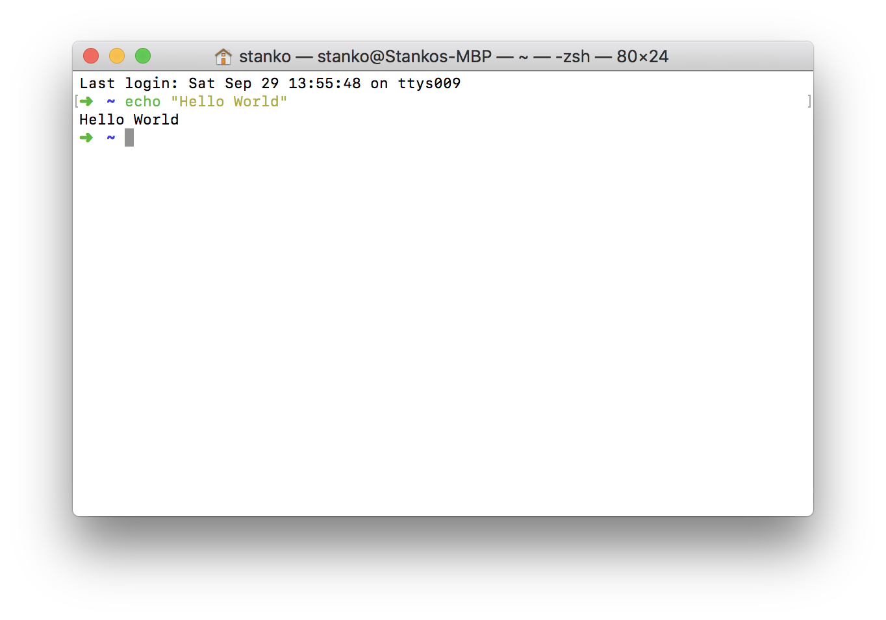

We can see where we are in the file system using the `pwd` (Print Working
Directory) command and list all files in the working directory using the `ls`
command (LiSt).

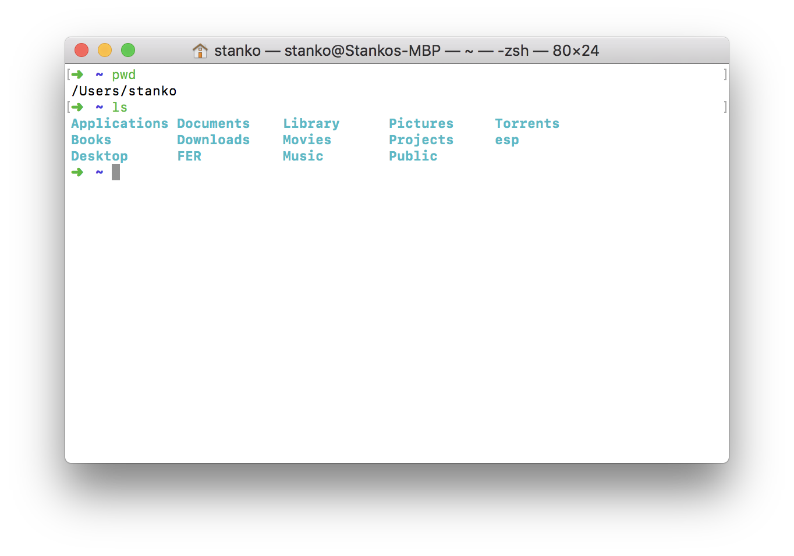

And we can navigate around using the `cd` (Change Directory) command. The `cd`
command takes a relative or absolute path as an argument, meaning that if we are
in the `/users/User` directory we can just type `cd Documents` to move to the
Documents directory, or we can give the full path to the Documents directory
like so `cd /users/User/Documents`, both commands have the same effect. `cd`
has two shortcuts: `.` and `..`. `cd .` will put you in the same place you were,
it's not really useful for navigating around, but for constructing relative
paths. While `cd ..` moves you one directory up (to the parent directory).

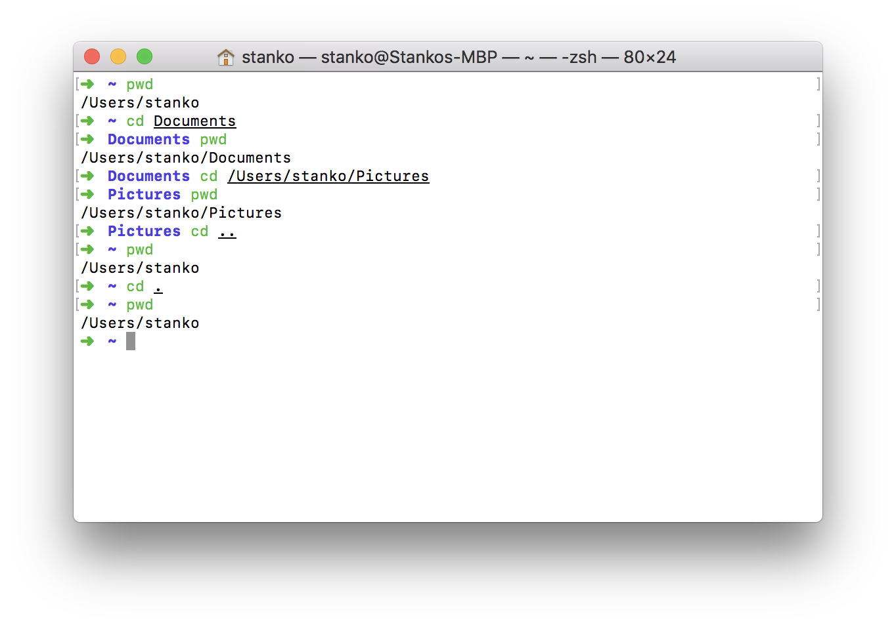

These are the basics you will need to know to get started. Later we will
introduce a few more concepts, but we'll use the above mentioned commands all
the time.

## Text editor

Programming is the activity of instructing the computer how to solve problems.
While we could certainly write ones and zeroes and give them to the processor,
this would get laborious, therefore people have invented programming languages
over the years.

The idea of a programming language is to provide a more natural way for a
human to give instructions to the computer. In my opinion Ruby masters this,
but you can be the judge of that at the end of this course.

To write programs in any programming language we need a text editor. Its useful
to move, copy, paste and organise the code you are going to write. Please note
that there is a difference between word processors like LibreOffice and MS Word,
and text editors. The output of a text editor is a text file, while the output
of a word processor is a custom file format alike to `.docx`. Text editors have
no notion of alignment or fonts or size, just content.

A good set of text editors for beginners are
[Atom](https://atom.io/),
[Sublime Text](https://www.sublimetext.com/) and
[VisualStudio Code](https://code.visualstudio.com/). All of which have
additional plugins/packages for working with Ruby that are recommended for this
course. If you are more of an IDE person, InteliJ makes an excelent IDE for Ruby
called [Ruby Mine](https://www.jetbrains.com/ruby/).

A text editor is like a religion to a programmer, so depending on why you ask
you will get a different answer which one is best. My suggestion it to pick
one that you are most comfortable with. If you end up not liking it, just
switch to another one.

## GIT version tracker

Git is a version-control system for tracking changes in computer files and
coordinating work on those files among multiple people.

It is primarily used for source-code management in software development, but it
can be used to keep track of changes in any set of files. As a distributed
revision-control system, it is aimed at speed, data integrity, and support for
distributed, non-linear workflows. Git was created by Linus Torvalds in 2005
for development of the Linux kernel, with other kernel developers
contributing to its initial development.
- [Wikipedia](https://en.wikipedia.org/wiki/Git)*

Basically git is a tool which helps developers, designers and any other
people avoid having to name their files *poster_final_final_4_final* or having
to share their data over USB stick, network disk, cloud or punch card stack.

It's not the only tool for versioning, you might be familiar with others such as
svn, mercurial or tfs. The reason why we opted to use git is because it's the
most popular and there is a myriad of websites which will be more than glad to
host your code for free. You are reading this on a GitHub but might know of
GitLab, Bitbucket or Beanstalk.

### How does it work?

Let's say that you have a file which is 10.000 lines of code and you are
modifying it multiple times every day. Storing a complete copy on every save
would be very inefficient regarding space. Instead, idea is to keep track of
changes.

Every change you make has to be committed to the repository. Hence change
increments are called 'commits' in git.

On every commit, git will look which files you have been changed and
compare which lines were added, removed or modified.

A git commit consists of consists of:

* an ID *(SHA-1 hash)*
* commit date
* authors name and email
* description of chnages *(commit message)*
* ID of previous commit
* changes to files

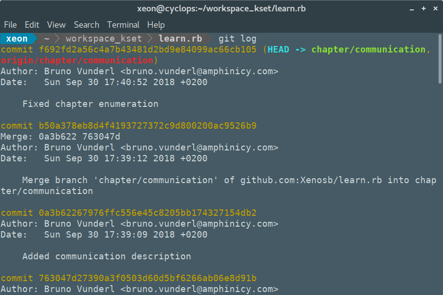

Git system will store all of your files in 3 different locations:

* filesystem,
* local repository
* remote repository

The first one is the file that you can view, edit or delete on your file system.
Once you've made some changes and have committed the to git they are stored in
your local repository.

When you are ready to share your work with others you ask git to push it to the
remote servers. From there other people can pull your code and modify it or they
can just admire your handy-work.

But working with others by pushing and pulling code from remote repositories
introduces the possibility to create conflicts.

A conflict is any change in which two people edited the same code in roughly the
same time. You can think of it this way - if you and a colleague are working
on the same book report, you are fixing typos while your college is actually
writing the report. If you fix a typo simultaneously as your colleague moves
that word, you will create a conflict. Why? Because the computer can't decide
which is the final version of the report - the one where you fixed the typo
or the one where your colleague moved the word around. Therefore it will prompt
you to settle this manually - hence the name conflict.

To avoid solving conflicts 33 times a day, it's a good practice to use
**branches**. Branches are different just versions of your code. In one version
your website might be ping, in the other it might be blue. As git allows you to
create a version from another version this starts to resemble a tree-like
structure, hence the name branches.

To explain this through our book report example. To avoid conflicts both you
and your colleague have to create a branch. On your branch you would only
fix typos, while your colleague would only write text on his. Then when the both
of you are done you can merge your branches together and resolve the conflicts
only once.

A generally good practice in programming is to create so called
**feature branches**. The idea is to separate work logically in smaller tasks.
E.g. changing the color of the website from blue to pink, or fixing typos.
When you want to create a new feature, you create a new branch and switch to it
Switching branches and versions is called a 'checkout' in git. This name is
a bit confusing but the checkout command can not only switch you from branch to
branch but also from commit to commit. Therefore you use checkout to take the
version you want to see.

After you checkout a branch, new commits that you now make will be pushed to the
new branch and won't conflict with any work that others are committing to their
branches.

The name of the default branch you have when you create a repository
is **master**. In many cases code in this branch is actually the code in
that is currently being used so you don't really want to push the changes
directly to it as any conflicts could break already working code.
To avoid conflicts on master be branch from it to a branch named **develop**
where feature get merged first and checks can be done to ensure that everything
works as expected.

When you are sure everything works, you will **merge** the latest code to the
master branch.

If you always merge new stuff to the develop branch and then merge the
develop branch into the master branch no conflicts can appear as the master
branch will always be behind the develop branch, in terms of changes made.
This is similar to copying homework. One person writes the homework first and
checks that all answers are correct and then you copy their homework. You can't
create a conflict as there aren't any changes being made to your homework until
the other person is done with theirs. In this example you are the master branch
and the other person is the develop branch.

### A typical workflow

Let's say that Bobo, Cindy and Dieter are developing in their spare time a
mobile application for checking the daily menu in a local canteen which allows
their team to vote where would they like to go for lunch.
Bobo will implement a system to fetch the menu from the local canteen's website,
Cindy will implement the voting system and Dieter decides to do the design.
As this are independent features, each of them will create a new branch.
Bobo will name his *feature/add-cantine-cassandra*,
Cindy will branch to *feature/implement-polls*
while Dieter will create *feature/design*.

Dieter does his task first and merges his work into develop branch. When done
with her work, Cindy will first **fetch** data from remote server to see if some
of here colleagues modified the develop branch in the meantime. If Dieters
modification didn't affect her work git will be able to **fast-forward** meaning
her changes are automatically merged.

Bobo finishes his feature last and
tries to merge but both him and Cindy modified the same function in one file. He
will now have the task to solve the **merge conflict**. He modifies the file so
that both features work but wants Cindy to inspect and approve the change. This
is why he decides to create a **pull request** and add her as an **approver**.
She will be notified of this and will able to review Bobos changes, ask for
changes and comment his work. When she is satisfied with that she will aproove
and now Bobo will be able to merge his work into develop. As this are all
features for this week, Bobo now creates a new pull request from develop to
master and adds Dieter as an approver so that he checks everything before the
release.

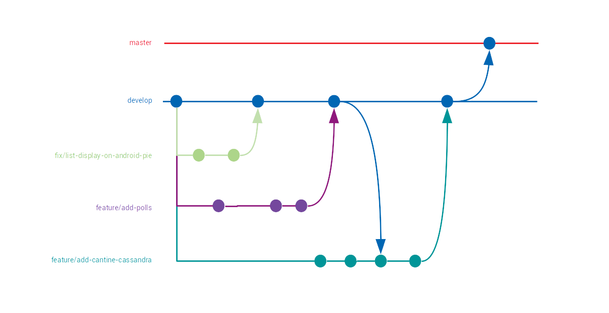

## Working with git

Although there are some popular graphical tools and integrations for git,
command line is still most preferred by large number of people.
You can learn more about these commands if you add
`--help` - eg. `git branch --help`.

`git clone` makes a clone of the remote repository on your machine. It's usually
the first step you will do when continuing the work on already existing
repository.

`git init` if remote repository is empty (repo with readme is not empty) it will
initialize it.

`git branch` allows you to list, create or delete branches

`git add` tells git to add the particular file, files or directory to the next
commit.

`git commit` will analyse the added (staged) files and create a commit in the
local repository.

`git status` shows the current branch, modified, added and removed files as well
as new files which are not tracked by git.

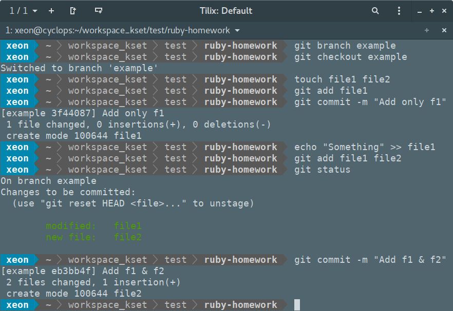

In this example, we first created a new branch called example. Then we have
created files file1 and file2. We have added file1 to git and commited our
changes. After that we modified file1 and added file2. Status now shows that
file1 was modified and file2 added, just as we expected. Commit will now save
these changes to the local repository.

`git log` lists the latest commits in the current branch. It will also indicate
where other branches are. To exit the view you need to press `q`.

In this example, you'll see that we are currently 2 modifications ahead of our
local master branch (green). Our current state is referred to *HEAD*. You'll also
notice 2 additional references colored in red. Those are references to the
remote repository called by default *origin*.

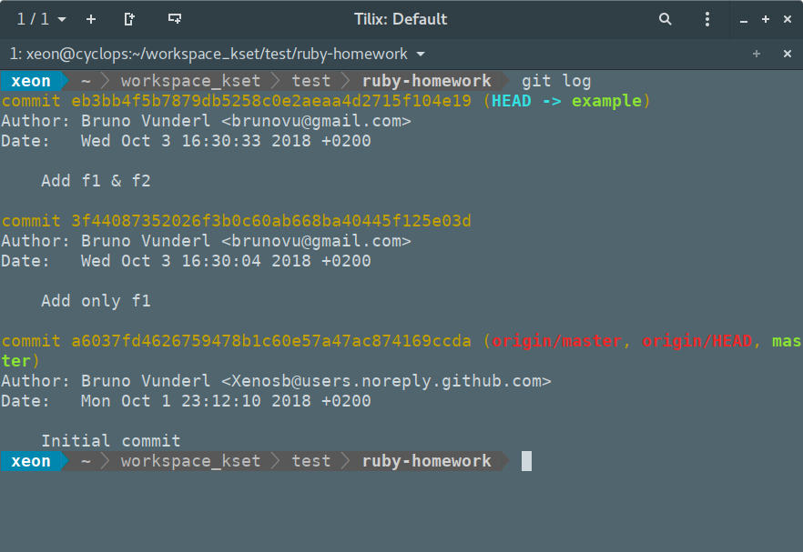

`git checkout` allows you to switch branches or to go to individual commits
and updates your file system to reflect the state of the repository you checked
out.

`git push` will push changes recorded in the local repository to the remote one.

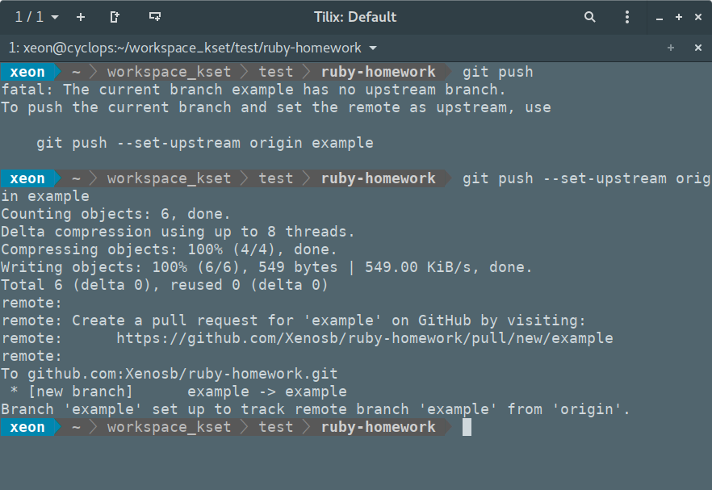

In this case you can notice that running default push failed as branch called
example does not exist on our remote repository. By running
`git push --set-upstream origin example` we tell that we want git to create
one for us.

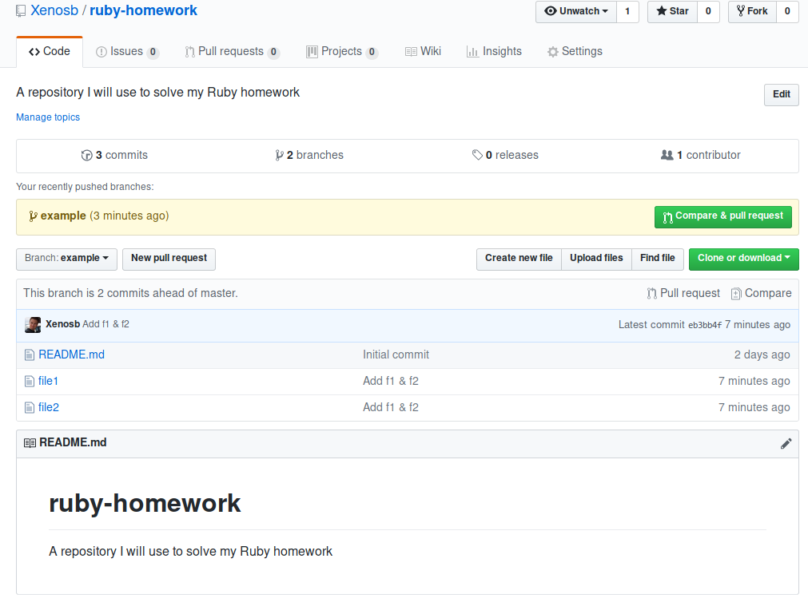

By following the link GitHub has provided in response to your push you will be
able to create a pull request from branch example to master branch or to any
other branch on the remote.

## Ruby runtime

Finally we get to install Ruby!

So what is a runtime and why do we need it to run Ruby programs?
There are many different kinds of programming languages, Ruby falls into the
category of a dynamically typed - interpreted language.

This means that your processor doesn't understand Ruby code directly, and Ruby
code never gets compiled to ones and zeroes. Instead we install a piece of
software called the virtual machine or runtime which reads our program
line-by-line and interprets the instructions we wrote in Ruby for the processor
to execute.

The opposite of this approach is a compiled language (e.g. C or C++)
where we write our code first, then we give it to a compiler which translates it
into zeroes and ones which the processor understands. The upside of this
approach is speed. A compiled program will always be faster then an interpreted
one. But the downside is portability, meaning a compiled program will only work
on computers with the same processor and has to be recompiled for all other
computers. Interpreted languages circumvent this issue by compiling only the
runtime for each computer, so that your program doesn't have to.

At the time of writing the newest version of Ruby is 2.5.
Ruby has many versions, to install and manage them we are going to install a
program called `rbenv` which, as the name suggests, is a Ruby environment
manager.

Before we continue, some Linux distributions and all MacOS distributions come
with Ruby pre-installed. You can open up a terminal and type in `ruby -v` to
check if you have it already installed (if it errors, you don't, else you do).
If you do, follow these instructions anyway as working with your system
installation of Ruby may cause subtle issues.

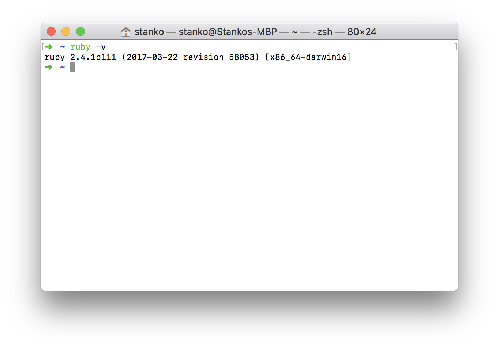

Before installing Ruby Linux users will have to install the
`build-essentials` packet, while Mac users have to install XCode from the
AppStore, open it and accept the terms of use.

```bash
# On Ubuntu/Debian
sudo apt install -y build-essentials libssl-dev libreadline-dev zlib1g-dev

# On Fedora/CentOS
sudo dnf groupinstall "Development Tools" "Development Libraries"
```

If you are on Windows, go to
[the RubyInstaller website](https://rubyinstaller.org/), download and run the
installer, and just follow the on-screen instructions.

If you are on Linux or Mac, run the following commands in succession, following
any and all on-screen instructions:

```bash
git clone https://github.com/rbenv/rbenv.git ~/.rbenv
cd ~/.rbenv && src/configure && make -C src
```

To determine which step to take next run the following command
```
echo "$SHELL"
```

Depending on the last word after the last ` \ ` in the previous command
run the appropriate command:

```bash
# /.../bash
echo 'export PATH="$HOME/.rbenv/bin:$PATH"' >> ~/.bash_profile
echo 'export PATH="$HOME/.rbenv/bin:$PATH"' >> ~/.bashrc

# /.../zsh
echo 'export PATH="$HOME/.rbenv/bin:$PATH"' >> ~/.zshrc

# /.../fish
set -Ux fish_user_paths $HOME/.rbenv/bin $fish_user_paths
```

The run:

```bash
~/.rbenv/bin/rbenv init
```

Close you terminal program, reopen it and run:

```bash
mkdir -p "$(rbenv root)"/plugins
git clone https://github.com/rbenv/ruby-build.git "$(rbenv root)"/plugins/ruby-build
```

Close you terminal program, reopen it and run:

```bash
rbenv install 2.5.0

rbenv global 2.5.0

echo 'eval "$(rbenv init -)"' >> ~/.bashrc
```

Once more, close and reopen your terminal and run:

```bash
ruby --version
```

You should see an output similar to the following:

```text
ruby 2.5.0p0 (YYYY-MM-DD revision XX) [x86_64-linux]
```

Huh, that was a lot. But now we have Ruby installed! Let's test our
installation!

Open up your text editor, create a new empty file and name it `test.rb` and
save it on your Desktop. In it copy the following:

```Ruby
puts '+==================+'
puts '| Ruby is amazing! |'
puts '+==================+'
```

And save the file.

Then find the file in your terminal (using `cd`). When you are in the same
directory as the `test.rb` file run the following command `ruby test.rb`.

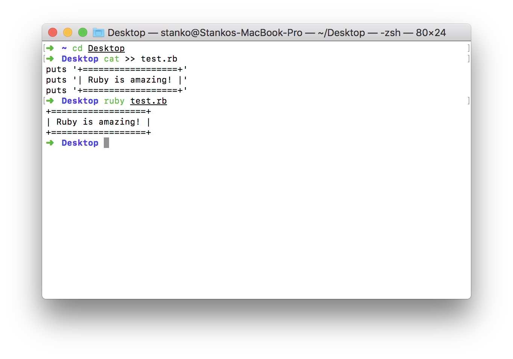

## Assignment

This chapter's homework includes creating your own repository on GitHub,
modifying the readme and creating a pull request. This workflow will be used
in the future for homework review as you will be adding members of teaching
staff as approvers/reviewers to your pull requests.

If you are already familiar with some of this steps, you can skip them.

1. [Create a GitHub account](#create-a-github-account)
2. [Create your first repository](#create-your-first-repository)
3. [GitHub interface overview](#github-interface-overview)
4. [Clone the repository](#clone-the-repository)
5. [Modify the readme](#modify-the-readme)
6. [Print in Ruby](#print-in-Ruby)
7. [Create your first pull request](#create-your-first-pull-request)

### Create a GitHub account

So let's start your journey to Ruby by creating a repository where you will
store your project and solve homeworks. Open
[GitHub homepage](https://github.com/) and sign in.

If you don't have an account already, sign-up process is easy - just enter your
username, email and password. Our suggestion would be to choose a
non-embarassing username as this will be public info. You don't have to put a
name behind your code or vice versa (in a CV or on Linkedin) but in future you
might wan't to do that and *princesspeach98* might not be the best choice.

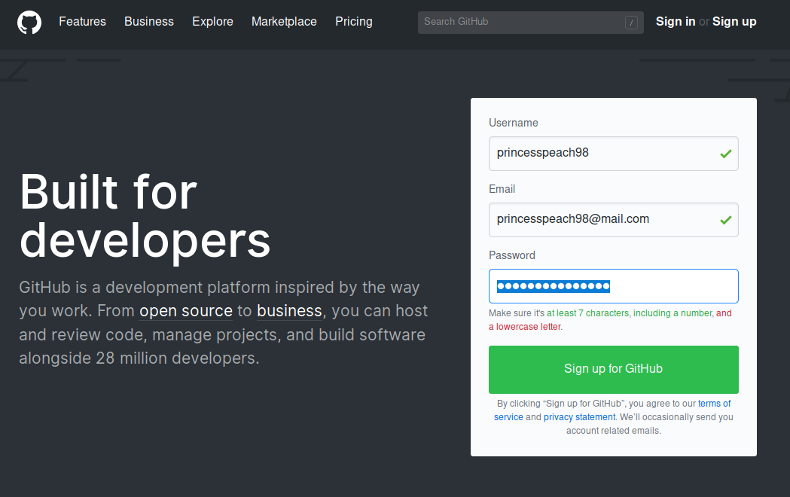

### Create your first repository

Navigate to 'New' in the menu or just open
[new repository page](https://github.com/new).

Enter `ruby-homework` as a repository name and for the description you can put
something like this `A repository I will use to solve my Ruby homework`.

Set the project to be **public**, you have nothing to hide. Initialize it **with
readme** and **without license and gitignore**.

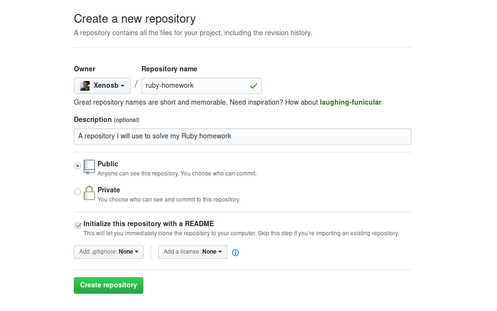

### GitHub interface overview

Congratulations, now you have a repository for your homework. It might your
first or fiftieth, we know you are excited. Take a look around the interface.
From the top to bottom and left to right, you can see the following info.

Navigation bar
* Owner / Project name - notice it is the same as URL
* Watchers - who is watching the project
* Stars - who marked project with a star
* Fork - who copied the project to contribute

Tabs
* Code - where the code is when not chugging beers in a local bar
* Issues - your code has none at the moment, that's great but if it will have
  some when it grows up people can report that issues here so you can have a
  talk
* Pull requests - incoming changes to your project that need a review
* Projects - if you want to plan features, rollouts etc
* Wiki - you can document your project here if you wish to do so
* Insights - graphs and insights to your project
* Settings - self explanatory, we'll have to modify something soon

Basic project info
* Repository description
* Topics - you can add tags so that your project will be easier to find
* Commits - how many changes were made to the project. Clicking on this will
  show you timeline what changes were made to the project, who made them and
  when
* Branches - will show you branches remote repository knows of
* Releases - if you have some release versions, they will be shown here
* Contributors - people colaborating on this project

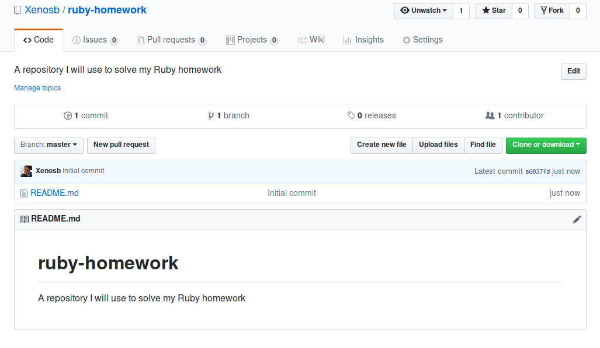

Now we come to repository controls. Depending on the permissions you have on the
project different some of these options might not be shown here.

* Current branch - branch you are currently looking at. Default one is called
  master.
* New pull request - if you have rights you'll be able to create one
* Create new file - don't know if anybody uses this but you can create text or
  source file directly through web interface. If you like whiteboard interviews
  this might be the way for you to work. Otherwise, there are better ways.
* Upload files - same as last one. Maybe more useful for designers.
* Find file - does exactly what it says
* Clone or download - allows you to get the code from GitHub repository to your
  computer

Little bit more info
* Last contributor and commit message
* Commit ID and time - you might use ID when referencing a specific commit
* List of files
* Preview of README.md file - it's written in a markdown. It's super-simple to
  write short or even long guides how to run your code, how you can contribute
  to the project or what it does. Modifying it will be a part of your first
  task.

OK, that's quite a lot of info. Don't even try to memorize this but play around
and visit some of the popular repositories to see how their info looks. For
example take a look at [Ruby](https://github.com/ruby/ruby) and
[Rails](https://github.com/rails/rails) repositories. You'll see that they are
made by the community, not by large enterprises governed by shareholders - for
the many, not for the few.

### Clone the repository

After you have created your first GitHub repository and familiarized yourself
with user interface, it has come time to clone it to your PC.

Open up the terminal emulator. Make sure you have git and it is in the
path by running `git --version`. If it gives you current version of git, it
works and if it doesn't know what git is, you'll have to install it. On MacOS
you should be prompted to install git if last command fails. On Linux you need
to run one of these commands to install git.

```bash
# On Ubuntu, Debian and similar distributions run this
sudo apt install git

# On Fedora, CentOS etc run this
sudo dnf install git
```

Now test it by running `git --version` to see if this is working.
In case it is, open a web browser and navigate to the repository you have just
created. Click on green button called `Clone or download` and copy the URL.

In the terminal, navigate to where you want to have your repository saved. Git
will automatically create a directory with the same name as your
repository so you don't have to be afraid that new files will appear in
your `C:` drive or home directory.

Now execute clone:

```bash
# Command should look something like this
git clone https://github.com/princesspeach98/ruby-homework.git
```

### Create your first branch

To have your code reviewed by teaching staff, you will have to create pull
requests when you are done with the homework. To be able to create pull request
you will first need a branch. Create one and don't forget to switch to it.

```bash
# Create a new branch
git branch feature/first-assignment

# Switch to the newly created branch
git checkout feature/first-assignment
```

### Modify the readme

Using your preferred text editor, open the file called `README.md`.
This file will, by default, be shown on your GitHub project's website. Code
formating and styling is achieved using markdown. Take look at [GitHub post
explaining markdown](https://guides.github.com/features/mastering-markdown/).

Markdown is a markup language, meaning it's used to style text in a way that
most program understand, but display the result differently.

Do the following tasks:
- [ ] Modify readme title annotated by 1st level header (`#`)
- [ ] Mention that you are following Ruby course
      `https://github.com/monorkin/learn.rb` and add a link using `[text](URL)`
- [ ] Add a 2nd level header (`##`) with title *My favorite programming
      languages*
- [ ] Add unsorted list of your favorite programming languages or books
- [ ] Italic ones you have used learned/read at university, bold ones you haven't
- [ ] Add image of your favorite dog breed `[Breed name](URL.png)`

### Print in Ruby

Open up your text editor and create an empty file in the directory where you
cloned the homework repository. Name the file `hello_world.rb`.

In it copy the following `puts '<message>'` and replace `<message>` with a
heartwarming message to the world.

### Share your work

Run the following command to publish your work to the remote repository:

```bash
git add README.md hello_world.rb
git commit
git push --set-upstream origin feature/first-assignment
```
Check if any errors were reported. If so, contact your lecturer.

### Create your first pull request

First you will have to add collaborators to your project. You can do that in the
GitHub project's settings. Navigate to the page
and add your lecturers as colaborators (in this case `monorkin` and `Xenosb`).
In the future you will add other members of the teaching staff.

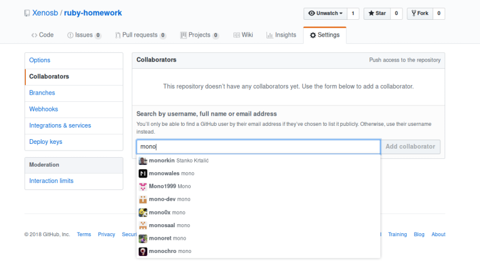

Return to your main page and you should see a yellowish bar and button with text
*Compare & pull request*. If this is no longer visible, you can click on button
*New pull request* and specify the branches. *base* is the branch you are
merging your *compare* branch.

Add members of teaching staff as reviewers, write a title and explanation that
make some sense - e.g. what have you modified. Scroll down and see what has
changed in the files. Removed files will be marked with red, added with green.
Click *Create pull request*.

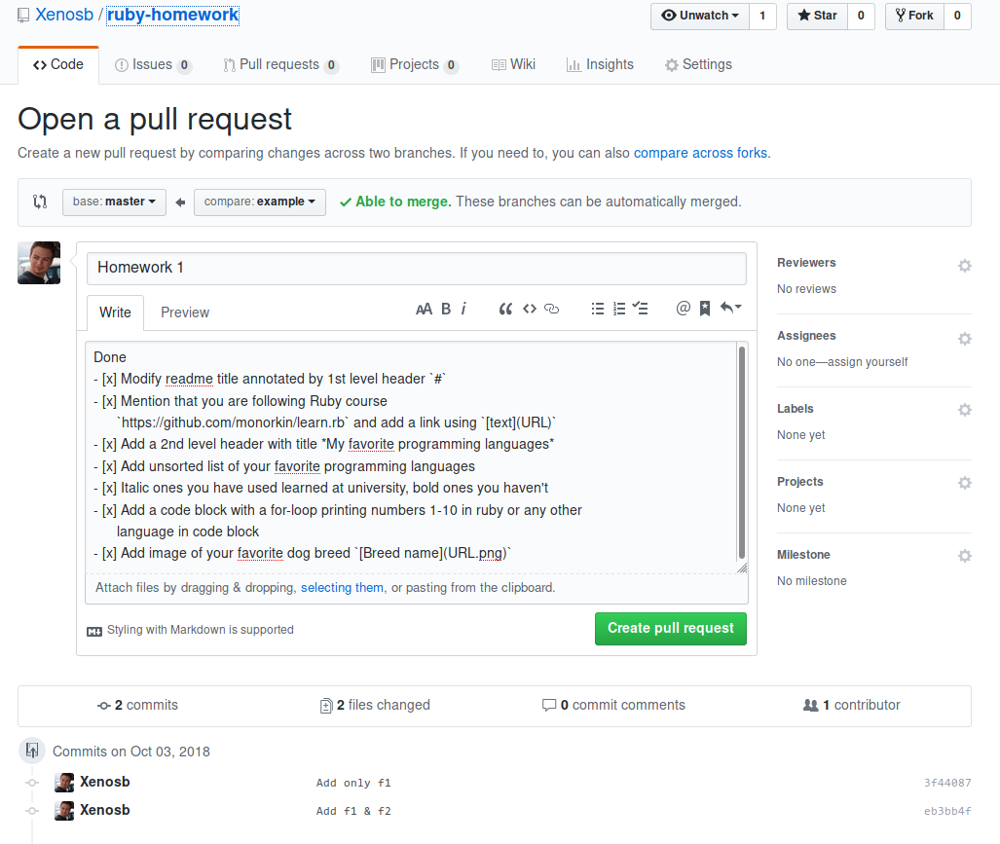

Now you have to wait for the review. :)

See you at the next lecture when we'll talk more about Ruby. If you noticed some
mistakes in the lecture or have some suggestions for us, feel free to contact
us.

**Happy hacking!**
