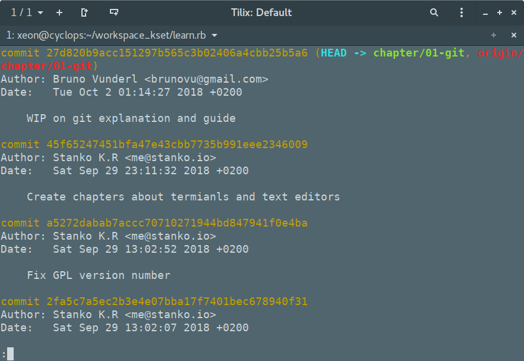

# Git gud

This is the first chapter in a series of 10 of the
[learn.rb project](https://github.com/monorkin/learn.rb) who's goal is to teach
people Ruby with a focus on Ruby on Rails.

The goal of this introduction chapter is to get you up and running with the
tools that we'll need to finish this course.

Please note that this project focuses on *nix operating systems, meaning
that Linux and Mac users will have a much easier time following it than
Windows users. This doesn't mean that examples for Windows users won't be given
just that some examples may not work out-of-the-box and the guide could have
discrepancies regarding software installation. Some of this issues can be
resolved by installing [Linux subsystem for Windows](https://docs.microsoft.com/en-us/windows/wsl/install-win10)
and your favorite Linux distribution from the Microsoft store.

Now, with the disclaimers out of the way, we can finally begin!

For this course we'll need four basic tools:
1. A terminal emulator
2. A text editor
3. The Git version tracker
4. The Ruby runtime

Let's take each tool and explain why we need it.

## The terminal emulator

Most programmers still to this day honor standards that were set in the 80's and
70's, because of that we to this day still use terminals to interact with all
programs we write.

Back in the 70's and 80's computers didn't have enough processing power to
render a full desktop with icons and run programs at the same time. Therefore
people used terminals to interact with the computer.

A terminal is basically a digital typewriter. You type in commands that the
computer executes and then it prints the result on screen.


As computers were extremely expensive back-in-the-day, terminals were built
down to a cost meaning that they had just enough processing power to render
the text on screen, the heavy lifting / computing was done by a mainframe
computer the terminal was attached to.


Therefore, most computer scientists and programmers used terminals to program
the mainframes and run programs. As terminals have been standardised and as
they are an operating system agnostic way to run and write programs, and as
they can connect to any computer to run software they are in wide use to this
day.

Every operating system ships with a terminal emulator. A program that emulates
the behaviour of the old-school terminals. So that you can run and interact with
software on your or another computer through it.

On most Linux systems the terminal emulator is called Terminal, as well as on
Mac, while on Windows the terminal emulator is called cmd.exe.

Any built-in terminal will be more than sufficient for this course.

So let's fire it up and do a couple of examples!


We can ask our computer to print out a message for us using the `echo` command.
For example `echo "Hello World"` will print out the words "Hello World" on
the screen.


We can see where we are in the file system using the `pwd` (Print Working
Directory) command and list all files in the working directory using the `ls`
command (LiSt).


And we can navigate around using the `cd` (Change Directory) command. The `cd`
command takes a relative or absolute path as an argument, meaning that if we are
in the `/users/User` directory we can just type `cd Documents` to move to the
Documents directory, or we can give the full path to the Documents directory
like so `cd /users/User/Documents`, both commands have the same effect. `cd`
has two shortcuts: `.` and `..`. `cd .` will put you in the same place you were,
it's not really useful for navigating around, but for constructing relative
paths. While `cd ..` moves you one directory up (to the parent directory).


This are the basics you will need to know to get started. Later we will
introduce a few more concepts, but we'll use the above mentioned commands all
the time.

## Text editor

Programming is the activity of instructing the computer how to solve problems.
While we could certainly write ones and zeroes and give them to the processor,
this would get laborious, therefore people have invented programming languages
over the years.

The idea of a programming language is to provide a more natural way for a
human to give instructions to the computer. In my opinion Ruby masters this,
but you can be the judge of that at the end of this course.

To write programs in any programming language we need a text editor. Its useful
to move, copy, paste and organise the code you are going to write. Please note
that there is a difference between word processors like LibreOffice and MS Word,
and text editors. The output of a text editor is a text file, while the output
of a word processor is a custom file format alike to `.docx`. Text editors have
no notion of alignment or fonts or size, just content.

A good set of text editors for beginners are
[Atom](https://atom.io/),
[Sublime Text](https://www.sublimetext.com/) and
[VisualStudio Code](https://code.visualstudio.com/). All of which have
additional plugins/packages for working with Ruby that are recommended for this
course. If you are more of an IDE person, InteliJ makes an excelent IDE for Ruby
called [Ruby Mine](https://www.jetbrains.com/ruby/).

A text editor is like a religion to a programmer, so depending on why you ask
you will get a different answer which one is best. My suggestion it to pick
one that you are most comfortable with. If you end up not liking it, jsut
switch to another one.

## GIT

Before we finally start discussing Ruby we'll explain git - what it is and
how we are going to use it in this project.

### What the git?

*(Shameless copy from [Wikipedia](https://en.wikipedia.org/wiki/Git))*

Git is a version-control system for tracking changes in computer files and
coordinating work on those files among multiple people. It is primarily used for
source-code management in software development, but it can be used to keep track
of changes in any set of files. As a distributed revision-control system, it is
aimed at speed, data integrity, and support for distributed, non-linear
workflows. Git was created by Linus Torvalds in 2005 for development of the
Linux kernel, with other kernel developers contributing to its initial
development.

*(End of shameless copy)*

So it's basically a tool which helps developers, designers and any other people
avoid having to name their files *poster_final_final_4_final* or having to
share their data over USB stick, network disk, cloud or punchcard stack. It's
not the only tool for versioning and you might be familiar with others such as
svn, mercurial or tfs. Reason we opted to use git is because it is most popular
and there is a myriad of websites which will be more than glad to host your
code for free. You are reding this on a GitHub but might be know of GitLab,
Bitbucket or Beanstalk.

### How does it work?

Let's say that you have a file which is 10.000 lines of code and you are
modifying it multiple times every day. Storing a complete copy on every save
would be very inefficient regarding space. Instead, idea is to keep track of
changes. On every commit, git will look which files you have modified and
compare which lines were added, removed or modified. You don't even have to
submit all files every time. When you submit modifications to the repository,
it's called a **commit**.

A git commit consists of consists of
* an ID *(SHA-1 hash)*
* commit date
* authors name and email
* description of chnages *(commit message)*
* ID of previous commit
* changes to files



Let's paint a picture where you are working on the same project and same file as
Anna. She likes to commit code very often not to lose it. Imagine if you'd have
to constantly receive updates and have the build fail because she messed
something up. To prevent this from happeng, give you a pice of mind and for some
other reasons, git actually works in such a way that the same file is stored in
**3 different locations - filesystem, local repository and remote repository**.
First one is a file that you can view, edit or delete on your file system. Once
you've made some changes and tested that it works or you just want to make sure
that you have your modifications saved on one aditional place, you can commit
changes to the local repository. When you think you are done with the feature,
you'll push the code from your local to the remote repository. At that time, git
will check if Anna made some modifications to the files you've been working on
and help you resolve conflicts if there were any.

But to avoid solving conflicts 3 times a day, it's a good practice to use
branches.

* Describe versions and commits
* Describe branches and pull requests
* Describe how we are going to use it

### Your first repository, or fiftieth

So let's start your journey to Ruby by creating a repository where you will
store your project and solve homeworks. Open
[GitHub homepage](https://github.com/) and sign in. If you don't have an account
already, sign-up process is easy - just enter your username, email and password.
Our suggestion would be to choose a non-embarrassing username as this will be
public info. You don't have to put a name behind your code or vice versa (in a
CV or on LinkedIn) but in future you might want to do that and
*princesspeach98* might not be the best choice.


Now, you'll create a new repository. Navigate to 'New' in the menu or just open
[new repository page](https://github.com/new). Enter `ruby-homework` as a
repository name and for the description you can put something like this
`A repository I will use to solve my Ruby homework`. Set the project to be
**public**, you have nothing to hide. Initialize it **with readme** and
**without license and gitignore**.


### GitHub interface overview

Congratulations, now you have a repository for your homework. It might your
first or fiftieth, we know you are excited. Take a look around the interface.
From the top to bottom and left to right, you can see the following info.

Navigation bar
* Owner / Project name - notice it is the same as URL
* Watchers - who is watching the project
* Stars - who marked project with a star
* Fork - who copied the project to contribute

Tabs
* Code - where the code is when not chugging beers in a local bar
* Issues - your code has none at the moment, that's great but if it will have
  some when it grows up people can report that issues here so you can have a
  talk
* Pull requests - incoming changes to your project, we'll cover this later
* Projects - if you want to plan features, rollouts etc
* Wiki - you can document your project here if you wish to do sos
* Insights - graphs and insights in your project
* Settings - self explanatory, we'll have to modify something soon

Basic project info
* Repository description
* Topics - you can add tags so that your project will be easier to find
* Commits - how many changes were made to the project. Clicking on this will
  show you timeline what changes were made to the project, who made them and
  when
* Branches - *versions* of the code, will be explained shortly
* Releases - if you have some release versions, they will be shown here
* Contributors - people colaborating on this project


Now we come to repository controls. Depending on the permissions you have on the
project different some of these options might not be shown here.

* Current branch - branch you are currently looking at. Default one is called
  master.
* New pull request - if you have rights you'll be able to create one
* Create new file - don't know if anybody uses this but you can create text or
  source file directly through web interface. If you like whiteboard interviews
  this might be the way for you to work. Otherwise, there are better ways.
* Upload files - same as last one. Maybe more useful for designers.
* Find file - does exactly what it says
* Clone or download - allows you to get the code from GitHub repository to your
  PC

Little bit more info
* Last contributor and commit message
* Commit ID and time - you might use ID when referencing a specific commit
* List of files
* Preview of README.md file - it's written in a markdown. It's super-simple to
  write short or even long guides how to run your code, how you can contribute
  to the project or what it does. Modifying it will be a part of your first
  task.

OK, that's quite a lot of info. Don't even try to memorize this but play around
and visit some of the popular repositories to see how their info looks. For
example take a look at [Ruby](https://github.com/ruby/ruby) and
[Rails](https://github.com/rails/rails) repositories. You'll see that they are
made by the community, not by large enterprises governed by shareholders - for
the many, not for the few.


## Ruby runtime

Finally we get to install Ruby!

So what is a runtime and why do we need it to run Ruby programs?
There are many different kinds of programming languages, Ruby falls into the
category of a dynamically typed - interpreted language.

This means that your processor doesn't understand Ruby code directly, and Ruby
code never gets compiled to ones and zeroes. Instead we install a piece of
software called the virtual machine or runtime which reads our program
line-by-line and interprets the instructions we wrote in Ruby for the processor
to execute.

The opposite of this approach is a compiled language (e.g. C or C++)
where we write our code first, then we give it to a compiler which translates it
into zeroes and ones which the processor understands. The upside of this
approach is speed. A compiled program will always be faster then an interpreted
one. But the downside is portability, meaning a compiled program will only work
on computers with the same processor and has to be recompiled for all other
computers. Interpreted languages circumvent this issue by compiling only the
runtime for each computer, so that your program doesn't have to.

At the time of writing the newest version of Ruby is 2.5.
Ruby has many versions, to install and manage them we are going to install a
program called `rbenv` which, as the name suggests, is a Ruby environment
manager.

Before we continue, some Linux distributions and all MacOS distributions come
with Ruby pre-installed. You can open up a terminal and type in `ruby -v` to
check if you have it already installed (if it errors, you don't, else you do).
If you do, follow these instructions anyway as working with your system
installation of Ruby may cause subtle issues.


Before installing Ruby Linux users will have to install the
`build-essentials` packet, while Mac userh have to install XCode from the
AppStore, open it and accept the terms of use.

If you are on Windows, go to
[the RubyInstaller website](https://rubyinstaller.org/), download and run the
installer, and just follow the on-screen instructions.

If you are on Linux or Mac,
run the following commands in succession, following any and all on-screen
instructions:

1. `git clone https://github.com/rbenv/rbenv.git ~/.rbenv`
2. `cd ~/.rbenv && src/configure && make -C src`
3. `echo "$SHELL"`
4. Depending on the last word after the last ` \ ` in the previous command
   run the appropriate command:
   - `bash` - `echo 'export PATH="$HOME/.rbenv/bin:$PATH"' >> ~/.bash_profile &&  echo 'export PATH="$HOME/.rbenv/bin:$PATH"' >> ~/.bashrc`
   - `zsh` - `echo 'export PATH="$HOME/.rbenv/bin:$PATH"' >> ~/.zshrc`
   - `fish` - `set -Ux fish_user_paths $HOME/.rbenv/bin $fish_user_paths`
5. `~/.rbenv/bin/rbenv init`
6. Close you terminal program & reopen it
7. `mkdir -p "$(rbenv root)"/plugins`
8. `git clone https://github.com/rbenv/ruby-build.git "$(rbenv root)"/plugins/ruby-build`
9. Close you terminal program & reopen it
10. `rbenv install 2.5.0`
11. `rbenv global 2.5.0`

Huh, that was a lot. But now we have Ruby installed! Let's test our
installation!

Open up your text editor, create a new empty file and name it `test.rb` and
save it on your Desktop. In it copy the following:

```Ruby
puts '+==================+'
puts '| Ruby is amazing! |'
puts '+==================+'
```

And save the file.

Then find the file in your terminal (using `cd`). When you are in the same
directory as the `test.rb` file run the following command `ruby test.rb`.


# Assignment

Clone the `ruby-homework` repository you created earlier from GitHub to your
computer. This can be done using the `git clone` command and the remote URL that
can be found on GitHub (when clicking on the green "Clone or download" button,
and choosing "use HTTPS" in the top right - if you see "use SSH" then just copy
the url).

When you run the command, git will ask you for your GitHub username and
password, this is normal, comply to the request.

Now you have a copy of your homework repository on your computer.

Open up your text editor and create an empty file in the directory where you
cloned the homework repository. Name the file `hello_world.rb`.

In it copy the following `puts '<message>'` and replace `<message>` with a
heartwarming message to the world.

When you are done commit your work using `git commit -m 'Hello world'` and then
push it to the remote using `git push`.

You are done when you can see the file you created through the GitHub interface.
When done, copy the URL of your GitHub repository and email it to the
instructor.

Happy hacking!
