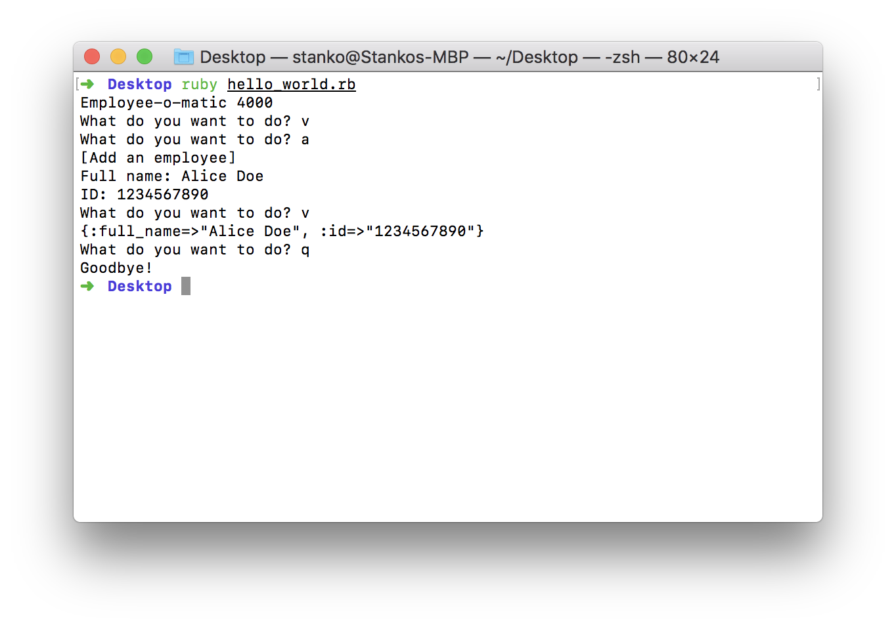
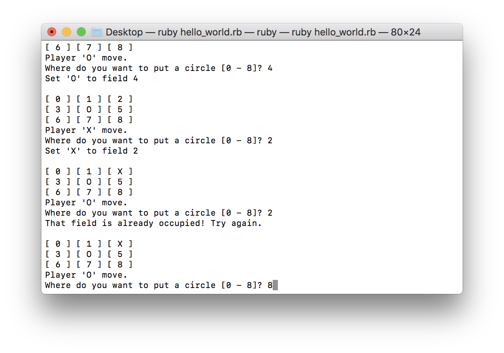

# Ruby, Ruby, Ruby! NaNaaNaNaaNaNaaaa

If you don't get the reference in the title just open
[this link](https://www.youtube.com/watch?v=qObzgUfCl28).

In the last chapters we focused mostly on setting up the environment to work
with Ruby and thought you the basics of Git. With that knowledge we can
work together and teach you Ruby through a practical project.

In this chapter we will teach you the basics of Ruby. We will start with loops
and ourself work up to objects and classes (if you didn't understand any of
these words, don't worry), mentioning important resources along the way.

## Table of contents

1. [Syntax, loops and wizard hats](#syntax-loops-and-wizard-hats)
   * [While loop](#while-loop)
   * [Loop do](#loop-do)
   * [Times loop](#times-loop)

2. [Input required](#input-required)
   * [Random](#random)
   * [Nil](#nil)
   * [Console input](#console-input)
   * [Conversion to integer](#conversion-to-integer)
   * [Conversion to float](#conversion-to-float)
   * [Formatting output](#formatting-output)
   * [If elsif else](#if-elsif-else)
   * [Next](#next)
   * [And and Or](#and-and-or)

3. [Working with data](#working-with-data)
   * [Arrays](#arrays)
   * [Hashes](#hashes)
   * [Switch case](#switch-case)
   * [Exiting the program](#exiting-the-program)
   * [Writing methods](#writing-methods)
   * [Lower and upper case](#lower-and-upper-case)
   * [Order of methods](#order-of-methods)
   * [Passing attributes](#passing-attributes)
   * [Chomping spaces](#chomping-spaces)
   * [Default return](#default-return)
   * [Sorting data](#sorting-data)
   * [Split, first and last](#split-first-and-last)

4. [Everything is an object](#everything-is-an-object)
   * [Writing classes](#writing-classes)
   * [Instance variables](#instance-variables)
   * [Getters and setters](#getters-and-setters) 
   * [Accessors and readers](#accessors-and-readers)
   * [Initializers](#initializers)
   * [Super method](#super-method)
   * [Checking classes and getting class names](#checking-classes-and-getting-class-names)

5. [Assignments](#assignments)

## Syntax, loops and wizard hats

[Ruby](https://en.wikipedia.org/wiki/Ruby_(programming_language))
was designed back in 1992 by
[Yukihiro Matsumoto](https://en.wikipedia.org/wiki/Yukihiro_Matsumoto). His
primary goal with Ruby was developer happiness. Therefore, you will notice,
that most Ruby code looks like
[pseudo-code](https://en.wikipedia.org/wiki/Pseudocode) (iterative text
describing an algorithm), there are many methods built-in into Ruby that
you won't found in most other languages and they will have more intuitive names
than in most other languages.

In the last chapter we created a `hello_world.rb` file containing a program that
prints a message of your choosing. Let's run it with `ruby hello_world.rb`
(note that you have to be in your terminal and in your homework directory from
last chapter). You should see your message on screen.


Let's change that program to print put 'Ruby'.

```Ruby
puts 'Ruby'
```

If we run this program we will see the following output:


Now, let's try and print out the title of this chapter. A program that does that
might looks something like this

```Ruby
puts 'Ruby, Ruby, Ruby! NaNaaNaNaaNaNaaaa'
```

And it would certainly work


Now, imagine your friend calls you, because they heard about your new program
and they need it for a class assignment, but they need it to print the word
'ruby' exactly 42 times. Can you help them?

With our current knowledge, the only way we can do it is by manually writing
'ruby' 39 more times which is not very helpful as it defeats the purpose of
writing a program. So let put our wizard/witch hats on and solve this issue.

To tackle this problem we will need a loop. Loops, as the name implies make
things run in a loop until we tell them to stop. This is perfect for our
problem!

Ruby supports many different kinds of loops - `while`, `each`, `times` and
`loop` each serving a different purpose. Let's inspect some of them.

### While loop

A `while` loops until a given condition is met. Let's try to print all numbers
from 0 to 100 using it:

```ruby
i = 0
while i < 100 do
  puts i
  i += 1
end
```


There is a lot going on here, lets explain the things we haven't seen before.
In this example `i` is a variable, meaning that `i` holds a value we assign to
it. In Ruby you can declare a variable by writing any one word followed by an
equals sign and a value. So `i = 0` is declaring a variable named `i` and
setting it's value to `0`.

The `i += 1` is shorthand notation for `i = i + 1` meaning that `+=` will
increment the variable on the left side by the value on the right side, in this
case by `1`.

Finally there is the `do ... end` - this is called a block. A block is any
piece of code surrounded by `do` and `end`. When used with loops any code inside
the block will be executed on each iteration of the loop. In the above example,
the lock contains a call to the `puts` method and `i += 1`, this code will be
run as long as `i` is less than 100.

### Loop do

Now, lets take a look at `loop`. It loops indefinitely or until the program
stops (you can stop most terminal programs by pressing `Ctrl` and `C`).
There are only a few use-cases for this kind of loop and you will rarely see
it in the wild.

```
loop do
  puts 'Are we there yet?'
end
```


A `loop` is the same as `while` with the condition `true`.

```ruby
while true do
  puts 'Are we there yet?'
end
```

The output of the while statement is the same as of the loop statement.

### Times loop

We will cover `each` later, so let's take a look at `times`. It loops exactly
the specified number of times - in that respect it's identical to our
while loop example, but you don't need to use a variable.

Let's see what a program using a loop might look like:

```Ruby
41.times do
  print 'Ruby, '
end
puts 'Ruby! NaNaaNaNaaNaNaaaa'
```


This is exactly the program our friend asked us to deliver! Great! But what is
that `print` method? `print` and `puts` are basically the same, the only
difference being that `print` doesn't move to a new line after it prints the
text while `puts` does.

E.g. three `puts` would do the following:

```ruby
puts 'Ruby'
puts 'Ruby'
puts 'Ruby'
```


While three `print` statements would do the following:

```ruby
print 'Ruby'
print 'Ruby'
print 'Ruby'
```


## Input required

With loops and print statements we can do a lot, but we can't interact with
the user. Inputs are important in programming! With inputs we gather data from
the user and inquiry their wishes, this helps us make more useful programs.

A more useful program would be a game! Let's make a guessing game!
In our game the computer thinks of a number between 0 and 100, and we try to
guess it. If our guess is too high or a too low the computer tells us that, if
we guessed the correct number the computer congratulates us and stops the game.

So, we have to loop until the user inputs the correct number, this is a good
candidate for a `while` loop

```ruby
number = rand(100)
guess = nil

puts 'Welcome to the guessing game!'

while guess != number do
  print 'Enter your guess: '
  guess = gets.to_i

  print "Your guess of #{guess} "

  if guess > number
    print 'is too high'
  elsif guess < number
    print 'is too low'
  else
    print 'is exactly right! Congratulations!'
  end

  print "\n"
end
```


There are quite a few new things here. Let's go through them one-by-one.

### Random

First, there's `number = rand(100)`, we already know that `number` is a
variable, but what is the `rand(100)`? `rand` is a method built-in into Ruby
that returns a random number between `0` and the number you give it. If you
don't give it a number it will return a random decimal number between `0` and
`1`.


### Nil

Ok, but what's going on here `guess = nil`? Again, we know that `guess` is a
variable, but what is `nil`. `nil`, otherwise known as `null` in other
languages represents the absence of data. `nil` is a powerful concept in
programming (that sometimes backfires, but that's a story for later), being able
to represent an absence of information is a information in its self helping us
to make sense of the user's inputs.

Let's give a tangible example. Let's say you are making a program that inquires
the user about their name and ID number. Some people might feel that giving
out their ID number is an invasion of their privacy and therefore it isn't
mandatory. Without `nil` we would have to find some number that represents
that no ID number exists, this might work for a while but would become
problematic over time. Let's say we chose `000000000` as our non-existent ID
number. Well, if you didn't know, Ramesses II (the ancient Egyptian pharaoh)
has a passport with the ID number `000000000` (this is a long, but true, story
you can research for your self). So even though Ramesses entered an ID number
our program would think he didn't, this is a problem. Therefore `nil` was
introduced to unambiguously represent no data.

### Console input

Let's inspect our game further. What is `guess = gets.to_i`, again we know
that `guess` is a variable. That means that we are assigning `guess` the value
of `gets.to_i`, but what is that? `gets.to_i` are actually two methods!
In Ruby most method calls are done by putting a dot (`.`) between a value and
a method. So let's look at these two methods `gets` and `to_i`.

If we open the
[Ruby documentation about `gets`](https://ruby-doc.org/core-2.2.3/Kernel.html#method-i-gets)
we can see that all `gets` does is it returns a value the user enters into the
terminal (note that the user has to hit enter before the value is registered).

[The official Ruby documentation](https://ruby-doc.org/) is a great resource
for learning and/or looking up unknown methods. You should reference it often
as it will teach you more than any other resource about how Ruby works and
what exists.

### Conversion to integer

So `gets` returns the user's input, but what does `to_i` do? `to_i` converts the
user's input to a number. By default a user's input is a string of letters, or a
string for short. While strings can be compared for equality e.g.
`'ruby' == 'ruby'` is true and `'ruby' == 'Ruby'` is false, numbers represented
as strings can't be compared with real numbers. So we wouldn't be able to
compare `guess` with `number` because `guess` would be a string and `number` is
a number. Therefore we convert `guess` to a number using `to_i`. The name `to_i`
comes from the name 'integer', `to_i` converts a string to a whole number.

### Conversion to float

An analogous method for decimal number would be `to_f` which would convert a
string to a decimal number. Why is it `to_f` and not `to_d`? This has a
historical reason, in computer science a decimal is a so called 'fixed point'
number and has to be specified with two numbers e.g. decimal(8,2) - meaning that
such a decimal can store 8 digits before the decimal point and two digits
after the decimal point (so `3.14` would work, but `3.148` would become `3.15`
in such a decimal). The opposite of a fixed point number is a floating point
number. Floating point numbers can store any number of digits after the
decimal point but at the cost of precision. Decimal numbers store the exact
value entered, while floating point number approximate the stored number.
E.g. the number `3.1415926535897932384626433` would become
`3.141592653589793` when represented as a floating point number while it would
stay the same when represented with a decimal(1,25). Why do we use floating
point numbers then? Computers are much faster when working with floating point
numbers then with decimal numbers. A decimal number can be up to 20 times slower
to calculate than a floating point one, and most of the time we don't need
high precision. Basically, floating point numbers are good enough for most
use-cases.

Oh! I nearly missed the condition of the `while` loop `number != guess`!
What is the `!=`? `!=` is the opposite of `==` which means equals, so
`!=` means different from. We use `==` for equals because we said earlier that
`=` declares a variable, so we need a new equals symbol - `==`. In most
programming languages putting a bang `!` before any operator inverts it's
function, so `!=` is different and `!true` is `false`, etc.

### Formatting output

Now, what is the `#{guess}` in the `print` statement
`print "Your guess of #{guess} "`? In Ruby, `#{}` is used to interpolate a
variable into a string. Basically instead of `#{guess}` the value of `guess`
gets printed into the string. But what if I want to write `#{guess}` and not
have it interpolated? Ruby has you covered there, it differentiates two kinds
of strings. Strings quoted with `'` don't get interpolated and are taken "as is"
while strings quoted with `"` get interpolated. But what if you want to have
both interpolated and non-interpolated values in the same string? You can
state that you don't want interpolation to happen by "escaping" the hashtag `#`
with a slash ` \ ` before it. E.g.

```
number = rand(42)
guess = gets.to_i

puts 'number: #{number} | guess: #{guess}'
puts "number: #{number} | guess: #{guess}"
puts "number: #{number} | guess: \#{guess}"
```


### If elsif else

Let's look at the `if` statement now.

```ruby
if guess > number
  print 'is too high'
elsif guess < number
  print 'is too low'
else
  print 'is exactly right! Congratulations!'
end
```

`if` statements enables us to any execute code conditionally. In other words,
"if this is true, do this". This `if` statements has an `elsif` statement in it.
`elsif` is short for `else if` meaning that any code in that block will be
executed only if the `if` statement didn't get executed and the condition
given to it is true. You can have as many `elsif` statements as you like, the
first one that's truthy (truthy means "it evaluates to true") will be executed
and no other. Finally there is `else`. It gets executed only if all previous
`if` and `elsif` statements were falsy.

Here `<` means that the left number is smaller than the right one, while `>`
means that the left number is larger than the right one. There are two
additional versions of these operators: `<=` and `>=` meaning less-or-equal and
greater-or-equal respectively.

It's important to know that to `if` statements `nil` is the same as `false` and
anything else is considered to be the same as `true`.
E.g.:

```ruby
if true
  puts "<3"
end

if 7
  puts "<3"
end

if false
  puts "</3"
end

if nil
  puts "</3"
end
```

This will only print two `<3` and no `</3` as both `nil` and `false` are falsy.
In Ruby only those values are falsy, everything else is truethy.

Ruby also provides a shorthand way to write in-line `if` statements like this:

```ruby
print 'How much is 3 + 3? '
answer = gets.to_i

puts 'That is correct!' if answer == 6

puts 'Thank you.'
```

There is also a negative version of `if` called `unless` that is often used
to give semantic meaning to the code. E.g. the following

```ruby
puts 'Welcome to the vote-o-mat 3000!'
print 'What is your age? '
age = gets.to_i

unless age >= 18
  puts 'You have to be at least 18 to cast a vote!'
  exit
end

print 'There are no candidates to vote for at the moment, try again later.'
```

this is the same as

```ruby
puts 'Welcome to the vote-o-mat 3000!'
print 'What is your age? '
answer = gets.to_i

if answer < 18
  puts 'You have to be at least 18 to cast a vote!'
  exit
end

print 'There are no candidates to vote for at the moment, try again later.'
```


Finally there is `print "\n"`. We already know about `print` so what is `"\n"`?
`"\n"` is a special character sequence that instructs the terminal to move to a
new line - therefore `\n` is known as a 'new line' or 'carriage return'
(here referring to the old typewriter carriages or heads). We have to use
double quotes `"` when working with special characters such as `\n` because,
as we learned earlier, single quotes `'` prevent interpolation and would
interpret `\n` as ` \ ` and `n`.

### Next

A tidbit I forgot to mention in the last loops chapter! Inside loops you
can use the `next` keyword to skip an iteration! E.g. let's print all even
numbers between 1 and 100. To figure out if a number is odd or even we need
the modulo operator `%`. The modulo operator returns the remainder of whole
number division e.g. `5 % 3` is `2` because `5 / 3` is `1` and the rest up to
five is `2`. So to figure out if a number is even we can write something
like this `number % 2 == 0` because if we divide the number by two, and there
is no remainder it must be a multiple of two and therefore even, else it's odd.

```ruby
i = 0
while i < 100 do
  i += 1
  next unless i % 2 == 0
  puts i
end
```


### And and Or

You will often have to check if two values for a condition and you will
need them both to satisfy a constraint, or just one. For that reason Ruby
implements 'or' `||` and 'and' `&&` operators.

```ruby
true && true # => true
false && true # => false
true && false # => false
false && false # => false

true || true # => true
true || false # => true
false || true # => true
false || false # => false

if (3 * 3 == 13) || (3 * 3 == 9)
  puts '3 * 3 is either 13 or 9'
end

if (4 * 4 == 16) && (3 * 3 == 9)
  puts '3 * 3 is 9 and 4 * 4 is 16'
end
```

The 'and' and 'or' operators have an interesting side effect. 'and' returns
the last truthy value or `false`, while 'or' returns the first truthy value or
`false`. This is called lazy evaluation. Let's take a look.

```ruby
name = nil || false || 'Alex' || 'Ross'
surname = 'Smith' && 'Ross'

puts name
puts surname
```


## Working with data

Suppose now that another friend calls you and asks you to help him out with his
job. They work at an HR department and have to work with lots of personal data
which is quite laborious to look up on paper. They ask you to make them a
program to keep track of all employees and their IDs. They have to be able to
input employees into the system, and be able to print all entered employees
sorted by surname. Let's help them out.

We know, we can gather user inputs with `gets` and that we can print data using
`puts` and `print`, but how can we store data?

### Arrays

To store lists of data Ruby has a type called an
[Array](https://ruby-doc.org/core-2.5.1/Array.html). Arrays can store large
amounts of values, be it strings or numbers or other things (to which we will
come in a minute).

You can create an array using square brackets `[]` and just put values between
them. E.g.:

```ruby
name = 'Hagrid'
age = 47

array = [name, age, 3.14, "And his name is #{name}", 3 + 3]

puts array
```


Arrays can also be expanded! You can add an element to an array by using the
shovel operator `<<`. E.g.:

```ruby
array = [1, 2, 3]

array << 5
array << 42
array << "ANYTHING!"

puts array
```


We can read any element of an array by accessing it. Accessing an array looks
something like this `array[0]` - this would return the first element of an
array. In Ruby, as in most other languages, indexes start at 0. So if we were
to count up we would start at `0` and then go `1`, `2`, `3`, ...

Ruby also supports negative indexes! So `array[-1]` would return the last
element of an array.

```ruby
array = ['Alice', 'Bob', 'Clay', 'Dudley', 'Eli', 'Fran', 'George']

puts array.inspect # `inspect` returns a sting representation of the array

size = array.count # Returns the number of elements in an array
i = 0

while i < size do
  puts "array[#{i}] = #{array[i]}"
  puts "array[#{-i}] = #{array[-i]}"

  i += 1
end
```


We could solve our friend's problem just by using arrays! We could
represent a single employee with an array consisting of a name and an id.
And we could store that array within another array that contains all employees.
E.g.:

```ruby
employees = [
  ['Alice Doe', '1234567890'],
  ['Bob John', '2345678901']
]

employees << ['Clay Chen', '3456789012']

puts employees[0][0] # => Alice Doe
puts employees[1][0] # => Bob John
puts employees[2][0] # => Clay Chen
```

### Hashes

While this is a possibility it's already confusing to access data in the
employees array. It would be much better if we could name an employee's
attributes. For that reason Ruby has
[hashes](https://ruby-doc.org/core-2.5.1/Hash.html). Hashes can be created with
curly braces `{}`. Hashes contain pairs of values, consisting of a name or
key and a value. E.g.:

```ruby
employees = []

alice = {
  full_name: 'Alice Doe',
  id: '1234567890'
}

employees << alice

puts employees.inspect
```


The cool thing about hashes is that they can be accessed just like arrays
e.g. `alice[:full_name]` will return Alice's full name. This is a big
improvement to readability compared to `alice[0]`. We can also set individual
values of a hash as if they were variables e.g. `alice[:id] = '42424242424242'`.

You might have noticed that we used `:full_name` and `:id` here. But what is
that string that starts with a colon `:`? It's called a symbol. Symbols are
quite similar to strings from the practical standpoint, but they don't have the
same methods as strings. Their primary purpose is to be used as keys or
labels. So don't be confused by them, they are just a nicer way to write hashes.
Without symbols our hash would look like this:

```ruby
employees = []

alice = {
  'full_name' => 'Alice Doe',
  'id' => '1234567890'
}

employees << alice

puts employees.inspect
```


This also shows another property of Hashes - anything can be a key, but then
we have to use a hash-rocket `=>` instead of a colon `:` to separate the key
from the value.

```ruby
some_hash = {
  1 => "Foo #{rand()}",
  bar: 'bar',
  :baz => :BAZ,
  [1,2,3] => 4,
  { a: 7 } => 8
}

puts some_hash[1]
puts some_hash[:bar]
puts some_hash[:baz]
puts some_hash[[1, 2, 3]]
puts some_hash[{ a: 7 }]
```


We can finally tackle our friend's problem!

Let's first implement the interface. Our program needs to ask the user if they
want to add a new employee or if they want to list all existing employees. Let's
implement that.

```ruby
puts 'Employee-o-matic 4000'

loop do
  print 'What do you want to do? '
  action = gets

  if action == 'a'
    puts 'add'
  elsif action == 'v'
    puts 'view'
  elsif action == 'q'
    puts 'quit'
  else
    puts 'help'
  end
end
```

### Switch case

This was simple enough. This example is a good use-case for a `loop` loop, as
we want our program to loop until the user specifies it should quit. Though,
if we decide to add more actions in the future our `if` clause could get
out-of-hand. For situations like these, when we are comparing a single value to
multiple possibilities, Ruby provides the `case` statement. Using it we can
rewrite the above as:

```ruby
puts 'Employee-o-matic 4000'

loop do
  print 'What do you want to do? '
  action = gets

  case action
  when 'a' then puts 'add'
  when 'v' then puts 'view'
  when 'q' then puts 'quit'
  else
    puts 'help'
  end
end
```

Let's implement the help action first. It's the easiest out of the four actions
we have.

```ruby
puts 'Employee-o-matic 4000'

loop do
  print 'What do you want to do? '
  action = gets

  case action
  when 'a' then puts 'add'
  when 'v' then puts 'view'
  when 'q' then puts 'quit'
  else
    puts '[HELP]'
    puts 'Enter one of the following:'
    puts 'a - to add a new employee'
    puts 'v - to view existing employees'
    puts 'q - to quit the program'
  end
end
```

### Exiting the program

Ok. Now lets implement the quit action. For this we will need to know about the
`exit` method which quits the current program.

```ruby
puts 'Employee-o-matic 4000'

loop do
  print 'What do you want to do? '
  action = gets

  case action
  when 'a' then puts 'add'
  when 'v' then puts 'view'
  when 'q' then exit
  else
    puts '[HELP]'
    puts 'Enter one of the following:'
    puts 'a - to add a new employee'
    puts 'v - to view existing employees'
    puts 'q - to quit the program'
  end
end
```

After we implement the add and view methods this program will become unreadable.
We need a way to to split our program into smaller pieces. We need to implement
our own methods. Our ideal program would look something like this:

```ruby
puts 'Employee-o-matic 4000'

loop do
  print 'What do you want to do? '
  action = gets

  case action
  when 'a' then add_employee
  when 'v' then view_employees
  when 'q' then quit
  else
    print_help
  end
end
```

### Writing methods

In Ruby, we can define our own methods with the `def` keyword like this:

```ruby
# Here we are declaring methods

def add_employee
  puts 'add'
end

def view_employees
  puts 'view'
end

def quit
  puts 'Goodbye!'
  exit
end

def print_help
  puts '[HELP]'
  puts 'Enter one of the following:'
  puts 'a - to add a new employee'
  puts 'v - to view existing employees'
  puts 'q - to quit the program'
end


# Main program starts here

puts 'Employee-o-matic 4000'

loop do
  print 'What do you want to do? '
  action = gets.downcase[0]

  case action
  when 'a' then add_employee
  when 'v' then view_employees
  when 'q' then quit
  else
    print_help
  end
end
```

### Lower and upper case

The strange line here is `gets.downcase[0]`, we already know of `gets` so
what does the rest do? Let's imagine that our user entered 'A' and replace
`gets` with that. Now we have `"A\n".downcase[0]`, but where did the `\n` come
from? Well, the `\n` is inserted when the user hits the enter key to confirm
his input. Now lets look at `downcase`. If you open up the string documentation
of Ruby, you can see that `downcase` converts all uppercase letters to lowercase
ones. If we apply this method to our input we get `"a\n"[0]`. Now we only have
the `[0]` to deal with. Strings, in some ways, act very much like Arrays. You
can access a String and get the letter at any position as if it were an Array.
So our `[0]` turns `"a\n"` into `"a"`.

Opposite command of `downcase` is `upcase`. Running `'This is A test 1'.upcase`
results in output `"THIS IS A TEST 1"` as an example.

### Order of methods

Can we define our methods after the loop? We can, but we can't use them in the
loop then. Ruby has to know those methods exist when it enters the loop, else
our program will error. This isn't the case always, as we will see later.

Here's how our program looks so far:


Now let's focus on our `add_employee` method. To add an employee to the list
we need their full name and id. We can get those using the `gets` method and a
little code. Let's get to it:

```ruby
def add_employee
  puts '[Add an employee]'
  print 'Full name: '
  full_name = gets.chomp
  print 'ID: '
  id = gets.chomp

  employee = {
    full_name: full_name,
    id: id
  }

  puts employee
end

def view_employees
  puts 'view'
end

def quit
  puts 'Goodbye!'
  exit
end

def print_help
  puts '[HELP]'
  puts 'Enter one of the following:'
  puts 'a - to add a new employee'
  puts 'v - to view existing employees'
  puts 'q - to quit the program'
end

puts 'Employee-o-matic 4000'

loop do
  print 'What do you want to do? '
  action = gets.downcase[0]

  case action
  when 'a' then add_employee
  when 'v' then view_employees
  when 'q' then quit
  else
    print_help
  end
end
```

### Passing attributes

Oh oh, we have a problem! Where do we put our newly created employee? We need
to create an array that stores all employees and pass it to our method, but how?
The `def` keyword allows us to define a method with a given name, if we want to
pass arguments to it we can just open a pair of brackets and write a name for
the argument. Here `def foo(bar)` we create a method named `foo` and it accepts
an argument named `bar`, now we can use `bar` as a variable in our method.
Let's apply this knowledge:

```ruby
def add_employee(employees)
  puts '[Add an employee]'
  print 'Full name: '
  full_name = gets.chomp
  print 'ID: '
  id = gets.chomp

  employee = {
    full_name: full_name,
    id: id
  }

  employees << employee
end

def view_employees(employees)
  puts employees
end

def quit
  puts 'Goodbye!'
  exit
end

def print_help
  puts '[HELP]'
  puts 'Enter one of the following:'
  puts 'a - to add a new employee'
  puts 'v - to view existing employees'
  puts 'q - to quit the program'
end

puts 'Employee-o-matic 4000'

employees = []

loop do
  print 'What do you want to do? '
  action = gets.downcase[0]

  case action
  when 'a' then add_employee(employees)
  when 'v' then view_employees(employees)
  when 'q' then quit
  else
    print_help
  end
end
```



What!? How does the array from the loop suddenly have Alice in it!? What is
this? The trick here is simple. In Ruby, when you pass a variable to a method
it's as if you handed that variable over to the other method. Any changes it
does to the variable will apply to your variable as well - if you want to read
more about this you can research 'Ruby pass by reference' which is a technical
term for the behaviour described above.

### Chomping spaces

In the code above, we used a method called `chomp`, all it does is it removes
all whitespaces before the first and after the last character.

### Default return

This is one way how we can return a value from a method, by modifying the
input. Another way is to return a value. In Ruby there are two explicit ways
how to return a value which are actually the same. The first is an explicit call
to the `return` keyword. The other is implicit, any value on the last line
of the method is implicitly returned. E.g. let's extract the `gets.downcase[0]`
into it's own method.

```ruby
def get_action
   return gets.downcase[0]
end

def get_action
   gets.downcase[0]
end
```

These two methods are exactly the same. The `return` keyword is a bit more
powerful though. Let's take a look at this method which greets all
employees except for Bob, nobody in the office likes Bob.

```ruby
def greet_employee(employee)
  return if employee[:name] == 'Bob'

  puts "Hi, #{employee[:name]}"
end
```

The above is called an 'early return' or 'guard case', it stops the method
if some condition isn't met. Note that it's possible to just wrap everything in
in `if` statement, but it's considered bad style as it often times gets messy
if you have multiple conditions.

Now our code looks like this:

```ruby
def add_employee(employees)
  puts '[Add an employee]'
  print 'Full name: '
  full_name = gets.chomp
  print 'ID: '
  id = gets.chomp

  employee = {
    full_name: full_name,
    id: id
  }

  employees << employee
end

def view_employees(employees)
  puts employees
end

def quit
  puts 'Goodbye!'
  exit
end

def print_help
  puts '[HELP]'
  puts 'Enter one of the following:'
  puts 'a - to add a new employee'
  puts 'v - to view existing employees'
  puts 'q - to quit the program'
end

def get_action
   gets.downcase[0]
end

puts 'Employee-o-matic 4000'

employees = []

loop do
  print 'What do you want to do? '
  action = get_action

  case action
  when 'a' then add_employee(employees)
  when 'v' then view_employees(employees)
  when 'q' then quit
  else
    print_help
  end
end
```

Let's implement the view method now. For this, we will finally introduce the
`each` loop! The `each` loop work only with values that are enumerable, we will
cover this characteristic later. But for now suffice to say that it only works
with values that can be interpreted as an array. `each` takes a block, as all
loops do, and will input a member of the enumerable one-by-one until it
reaches the end of the enumerable.

Let's look at the implementation.

```ruby
def add_employee(employees)
  puts '[Add an employee]'
  print 'Full name: '
  full_name = gets.chomp
  print 'ID: '
  id = gets.chomp

  employee = {
    full_name: full_name,
    id: id
  }

  employees << employee
end

def view_employees(employees)
  employees.each do |employee|
    puts "#{employee[:full_name]}, #{employee[:id]}"
  end
end

def quit
  puts 'Goodbye!'
  exit
end

def print_help
  puts '[HELP]'
  puts 'Enter one of the following:'
  puts 'a - to add a new employee'
  puts 'v - to view existing employees'
  puts 'q - to quit the program'
end

def get_action
   gets.downcase[0]
end

puts 'Employee-o-matic 4000'

employees = []

loop do
  print 'What do you want to do? '
  action = get_action

  case action
  when 'a' then add_employee(employees)
  when 'v' then view_employees(employees)
  when 'q' then quit
  else
    print_help
  end
end
```


### Sorting data

Now we only need to sort the array of employees. This is fairly simple to do
using the `sort_by` method. It accepts a block in which wee have to specify the
key by which it will sort an array in ascending order.

```ruby
def add_employee(employees)
  puts '[Add an employee]'
  print 'Full name: '
  full_name = gets.chomp
  print 'ID: '
  id = gets.chomp

  employee = {
    full_name: full_name,
    id: id
  }

  employees << employee
end

def view_employees(employees)
  sorted_employees(employees).each do |employee|
    puts "#{employee[:full_name]}, #{employee[:id]}"
  end
end

def sorted_employees(employees)
  employees.sort_by do |employee|
    employee[:full_name].split(' ').last
  end
end

def quit
  puts 'Goodbye!'
  exit
end

def print_help
  puts '[HELP]'
  puts 'Enter one of the following:'
  puts 'a - to add a new employee'
  puts 'v - to view existing employees'
  puts 'q - to quit the program'
end

def get_action
   gets.downcase[0]
end

puts 'Employee-o-matic 4000'

employees = []

loop do
  print 'What do you want to do? '
  action = get_action

  case action
  when 'a' then add_employee(employees)
  when 'v' then view_employees(employees)
  when 'q' then quit
  else
    print_help
  end
end
```


### Split, first and last

So... What does this do?

```ruby
def sorted_employees(employees)
  employees.sort_by do |employee|
    employee[:full_name].split(' ').last
  end
end
```

We already know how the method works, so we can ignore it. And we know that
`employees` is an array, and that `sort_by` will order it in an ascending order
depending on the value return in it's block. We also know what
`employee[:full_name]` returns the employee's name. So let's look at a simpler
example - `'Alice Doe'.split(' ').last`. `split`, as the name implies, splits
the string into an array of smaller strings. We give it the charactere on which
we want to split the string, in our case a space ` `. Let's expand this -
`['Alice', 'Doe'].last`. Now we only have to explain the `last` method - it
returns the last member of the array.

Just like `last`, `first` will return the first element of the array. You might
use the old school way of writing `[0]` but this notation is more easily
readable and is more semantic.

A this looks kind of messy. Let's take a look how we can improve this.

## Everything is an object.

Ruby is a multi paradigm language, meaning it follows many schools of thought
regarding how one should write code. This paragraph will cover the
object-oriented paradigm, and how to implement it in Ruby.

Let's start from our previous employee list example. To get the surname of each
employee we had to do the following:

```ruby
employee[:full_name].split(' ').last
```

This isn't terribly complicated, but let's say that we write a bigger program
where we use this code three times, once to sort the list, once to print the
employee's name in the format 'surname, first name' and once to search for all
users with that surname. Then our friend calls us and tell us that the entered
`Tim Berners Lee` into our program and that it returned him at the bottom
of the list instead of the top. The program used 'Lee' as the surname, when
actually the surname is 'Berners Lee'. Now we have to go about our code and fix
all three implementations of the surname extraction code. What options do we
have to avoid this scenario?

We could create a method! This would work, but could get cumbersome if we start
extracting all shared code this way, as we would run out of names pretty soon,
and would have to resort to long descriptive names such as
`the_method_that_paints_all_links_pink_if_the_user_clicks_the_second_button_from_the_left_on_the_login_screen`.
This would be problematic to remember.

In the objective-oriented paradigm we solve this issue using objects. The cool
thing is that you have already used objects! In Ruby, literally everything is
an object. Strings, Numbers, Arrays, Hashes, all are objects. Anything that
looks like `something.foo` is an object. Here `something` is an object and
`foo` is a method of that object.

### Writing classes

How can we create our own objects? First we need to learn what a `class` is.
A class is a blueprint for making objects. This all sounds confusing so lets
give a practical example.

```ruby
class Employee
  def name
    'Alice'
  end
end
```

Here we have created a class named `Employee` which has an instance method
named `name` which always returns `Alice`. Let's test it out! To create an
object from that class we have to use it's `new` method.

```ruby
class Employee
  def name
    'Alice'
  end
end

employee = Employee.new
puts employee.name
```


As explained earlier `class Employee` defines the class, then
`employee = Employee.new` creates a new object of type Employee - a new
instance of the Employee class. `employee.name` calls the name method we defined
in the class, which returns 'Alice'. Therefore the `puts` statement prints
'Alice'. Neat!

### Instance variables

Inside classes we can use a special type of variable! It's named an instance
variable. Instance variables look and act just like normal variables but their
name starts with an `@` and they can only be accessed inside an instance of
a class.

```ruby
class Employee
  def set_name(name)
    @name = name
  end

  def name
    @name
  end
end

employee = Employee.new
employee.set_name('Bob')
puts employee.name
```


### Getters and setters

The `set_name` method is called a setter, as it's only used to set a value. The
`name` method is named a getter, as it's only used to get a value. In Ruby we
can create beautiful setters by suffixing the name of the getter method with
an equals sign `=`. E.g.

```ruby
class Employee
  def name=(name)
    @name = name
  end

  def name
    @name
  end
end

employee = Employee.new
employee.name = 'Bob'
puts employee.name
```


### Accessors and readers

Not to repeat our selves constantly, Ruby provides two special keywords that
only work inside a class definition - `attr_accessor` and `attr_reader`.
`attr_accessor` automatically creates a beautiful setter, getter and variable
with a given name. While `attr_reader` only creates a getter.

```ruby
class Employee
  attr_accessor :name
end

employee = Employee.new
employee.name = 'Bob'
puts employee.name
```


### Initializers

But what if we want to create a 'Bob' object right away, instead of creating
an empty object and then setting it's name to 'Bob'? For this purpose we can
implement a special method called the `initialize` method. The initializer is
the first method that gets called when a new object is passed. All arguments
given to the `new` method are passed to the `initialize` method also.

```ruby
class Employee
  attr_accessor :name

  def initialize(name)
    @name = name
  end
end

employee = Employee.new('Bob')
puts employee.name

employee.name = 'Alice'
puts employee.name
```


Let's try to model our employee using a class! The implementation would look
like this.

```ruby
class Employee
  attr_accessor :full_name
  attr_accessor :id

  def initialize(full_name, id)
    @full_name = full_name
    @id = id
  end
end
```

Now, let's add our surname method to the class.

```ruby
class Employee
  attr_accessor :full_name
  attr_accessor :id

  def initialize(full_name, id)
    @full_name = full_name
    @id = id
  end

  def surname
    @full_name.split(' ').last
  end
end
```

Let's try it out.

```ruby
class Employee
  attr_accessor :full_name
  attr_accessor :id

  def initialize(full_name, id)
    @full_name = full_name
    @id = id
  end

  def surname
    @full_name.split(' ').last
  end
end

employee = Employee.new('Alice Doe', '1234567890')
puts employee.full_name
puts employee.id
puts employee.surname
```


Now, let's try and fix the problem experienced with 'Tim Berners Lee'.

```ruby
class Employee
  attr_accessor :full_name
  attr_accessor :id

  def initialize(full_name, id)
    @full_name = full_name
    @id = id
  end

  def surname
    @full_name.split(' ', 2).last
  end
end

employee = Employee.new('Alice Doe', '1234567890')
puts employee.full_name
puts employee.id
puts employee.surname
```

The only line we needed to change was `split(' ')` by giving it a second
argument. `split(' ', 2)` means split the string into exactly two string on a
space ` ` charactere. So `'Tim Berners Lee'` becomes `['Tim', 'Berners Lee']`.
Hazaa! Our issue is fixed! Let's see it all together now.

```ruby
class Employee
  attr_accessor :full_name
  attr_accessor :id

  def initialize(full_name, id)
    @full_name = full_name
    @id = id
  end

  def surname
    @full_name.split(' ', 2).last
  end
end

def add_employee(employees)
  puts '[Add an employee]'
  print 'Full name: '
  full_name = gets.chomp
  print 'ID: '
  id = gets.chomp

  employee = Employee.new(full_name, id)

  employees << employee
end

def view_employees(employees)
  sorted_employees(employees).each do |employee|
    puts "#{employee.full_name}, #{employee.id}"
  end
end

def sorted_employees(employees)
  employees.sort_by do |employee|
    employee.surname
  end
end

def quit
  puts 'Goodbye!'
  exit
end

def print_help
  puts '[HELP]'
  puts 'Enter one of the following:'
  puts 'a - to add a new employee'
  puts 'v - to view existing employees'
  puts 'q - to quit the program'
end

def get_action
   gets.downcase[0]
end

puts 'Employee-o-matic 4000'

employees = []

loop do
  print 'What do you want to do? '
  action = get_action

  case action
  when 'a' then add_employee(employees)
  when 'v' then view_employees(employees)
  when 'q' then quit
  else
    print_help
  end
end
```


## Inheritance

We have gotten quite popular among our friends with our programming skills!
Every day somebody rings us up and asks for help. This time a veterinarian.
They are building an index of all animals they know how to cure but have trouble
identifying. With our knowledge of objects and arrays we spring to work and
implement our first version of the program.

```ruby
class Cat
  def sound
    'miaaaaauuuu'
  end
end

class Dog
  def sound
    'wooof'
  end
end

class Duck
  def sound
    'quack'
  end
end

class Snail
end

animals = [Cat.new, Dog.new, Duck.new, Snail.new]

puts animals[0].sound
puts animals[1].sound
puts animals[2].sound
puts animals[3].sound
```


Oh oh, our program is throwing an error! The snail doesn't know how to make a
sound! But all animals make a sound! How can we solve this? We can solve this
using inheritance. Inheritance allows one class to get all methods from
their parent as if they were it's own. Inheritance is done using the less than
sign `<` after a class's name - like so `class Child < Parent`. The child can
have it's own implementation of the method, it will get executed instead of
the parent's version.

```ruby
class Animal
  def sound
    nil
  end
end

class Cat < Animal
  def sound
    'miaaaaauuuu'
  end
end

class Dog < Animal
  def sound
    'wooof'
  end
end

class Duck < Animal
  def sound
    'quack'
  end
end

class Snail < Animal
end

animals = [Cat.new, Dog.new, Duck.new, Snail.new]

puts animals[0].sound
puts animals[1].sound
puts animals[2].sound
puts animals[3].sound
```


### Super method

What if we want to access the parent's implementation form the child? For those
situations there is the `super` keyword - it calls the parent's implementation.
Oddly enough, if the method you are overriding accepts any arguments, you don't
need to pass them to the `super`, they will get passed automatically.

```ruby
class Dog
  def bark
    'woof'
  end
end

class ShibaInu < Dog
  def bark
    "#{super} wo #{super} wooooo"
  end
end

shiba = ShibaInu.new
puts shiba.bark
```


How can we practically apply this to our employee list application? Let's
suppose we have different types of employees - programmers and office managers.
For a programmer we would like to know what programming languages they know,
while for an office manager we would like to know the office they work at.

```ruby
class Employee
  attr_accessor :full_name
  attr_accessor :id

  def initialize(full_name, id)
    @full_name = full_name
    @id = id
  end

  def surname
    @full_name.split(' ', 2).last
  end
end

class Programmer < Employee
  attr_accessor :languages

  def initialize(full_name, id, languages)
    super(full_name, id)
    @languages = languages
  end
end

class OfficeManager < Employee
  attr_accessor :office

  def initialize(full_name, id, office)
    super(full_name, id)
    @office = office
  end
end

employee = Employee.new('Alice Doe', '1234567890')
programmer = Programmer.new('Bob Smith', '2345678901', ['Ruby', 'Elixir'])
office_manager = OfficeManager.new('Clay Bush', '3456789012', '37 Main street')

puts employee.surname
puts programmer.surname
puts office_manager.surname
puts
puts programmer.languages.inspect
puts office_manager.office
```


This is really cool! Using inheritance we don't have to re-implement the
surname method for programmers and office managers, and each can have their
own additional methods.

### Checking classes and getting class names

We will often need to know what kind of object we are dealing with. Is it an
`Employee`, or a `Programmer` or an `OfficeManager`. We have three ways to
figure that out. The first is using the `class` method on an object like this
`Programmer.new.class` which returns `Programmer`. This could work but what
if we want to check if something is a sub-class of `Employee`? Well the `class`
method wouldn't work. But we can use the `is_a?` method! It works like this
`Programmer.new.is_a?(Employee)` which would return `true` if the object is
of class `Employee` or a sub-class of it. But this would get cumbersome if we
would have to check against multiple classes, therefore the `case` clause does
class matching automatically! E.g.:

```ruby
employee = Programmer.new

case employee
when OfficeManager then puts 'Office Manager'
when Employee then puts 'Employee'
when Programmer then puts 'Programmer'
end
```


# Assignment

- Implement the ability to edit an employee in our employees program.
  * [ ] the edit actions should be `e`
  * [ ] editing a user is the same as adding, ask for their full name and id
  * [ ] print the current value for the full name and id before editing


- Implement the ability to sort either by first or last name to our employee
program
  * [ ] ask the user if they want to sort by first `f` or last `l` name
  * [ ] print the sorted list depending on the user's action


- Implement the ability to insert programmers and office managers in our
employee program.
  * [ ] on the add action the user should be able to choose between adding a
  regular employee `e`, a programmer `p` or an office manager `o`.
  * [ ] on the view action next to programmers print the programming
  languages they know, next to office managers print their office.
  * [ ] assume that it's not possible to change an employee's role when editing
  * [ ] enable editing of programming language / office fields



- Create a game of tic-tac-toe
  * [ ] at the beginning of each round the full game board has to be drawn
  * [ ] indicate which player's turn it is
  * [ ] mark fields with `X` and `O`
  * [ ] mark empty fields with numbers from 0 to 8, starting in the top left
  field
  * [ ] ask the user in which field they want to put their symbol
  * [ ] don't allow users to override a previously set `X` or `O`
  * the user `O` always goes first
  * the user `X` always goes second
  * you don't need to detect when somebody won
  * you don't need to put in a quit condition (use `Ctrl` + `C`)


Crate three separate files for each assignment and put them in your
`ruby-homework` directory, add, commit, and push the files to the
`feature/second-homework` branch. Assign your teachers as the reviewers of the
branch.
