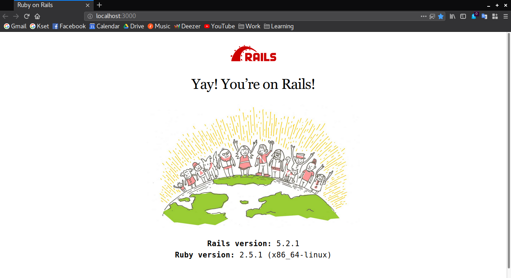
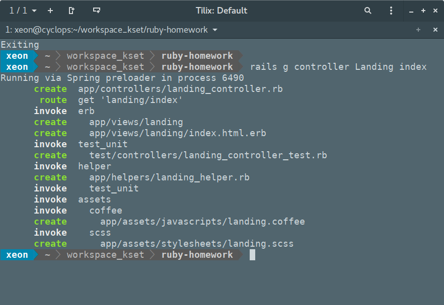
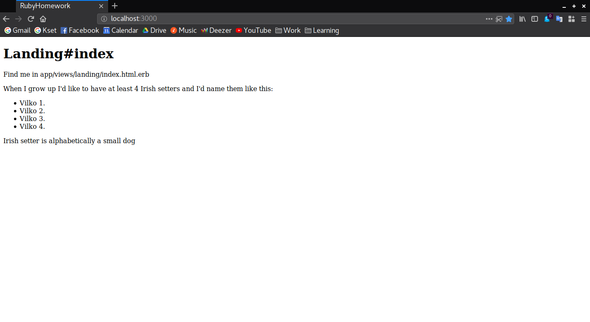
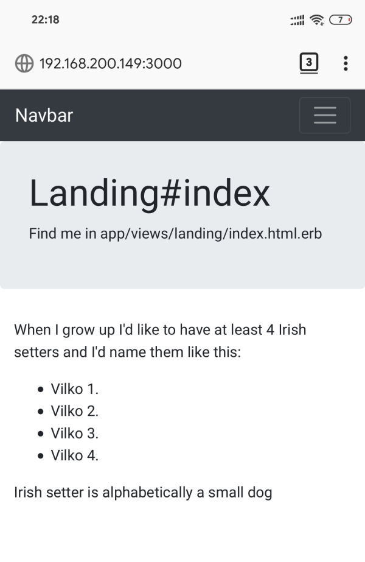
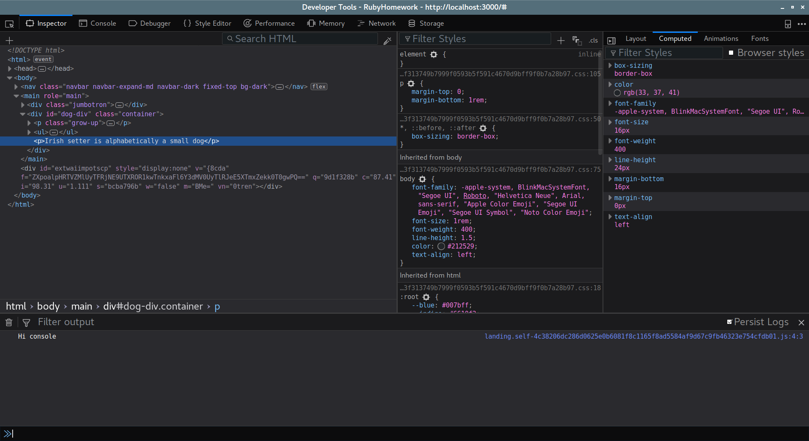
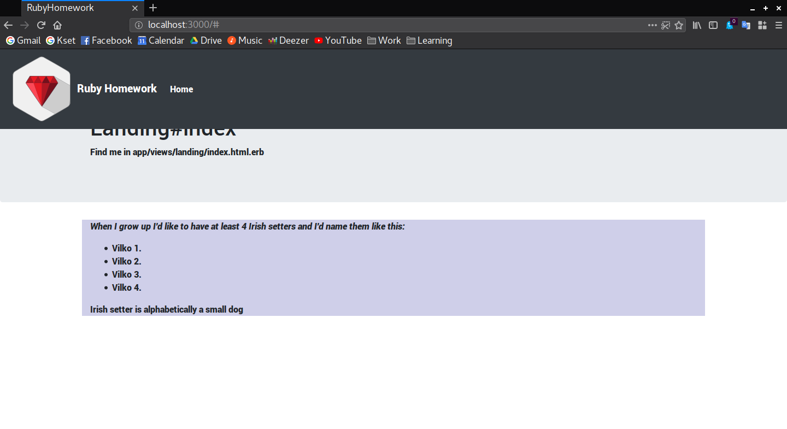
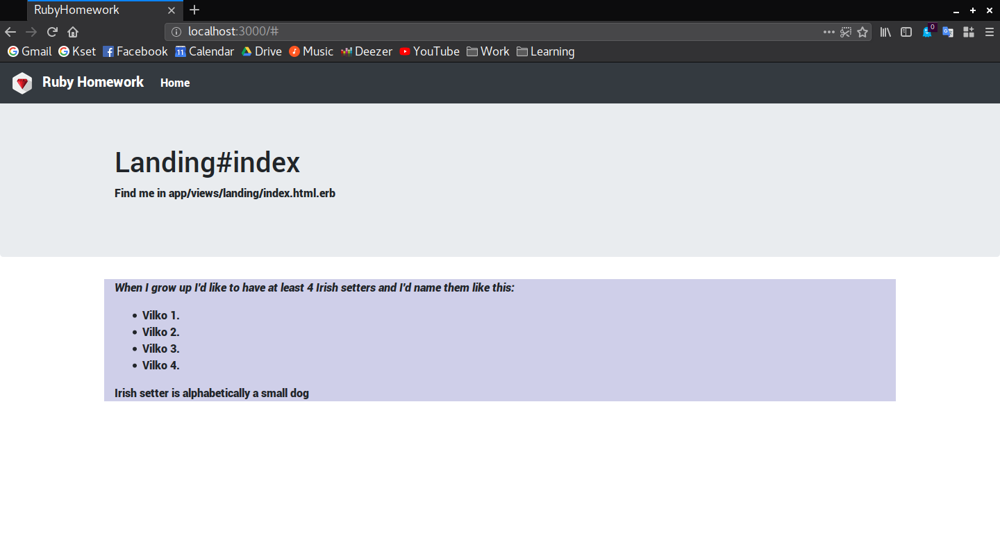
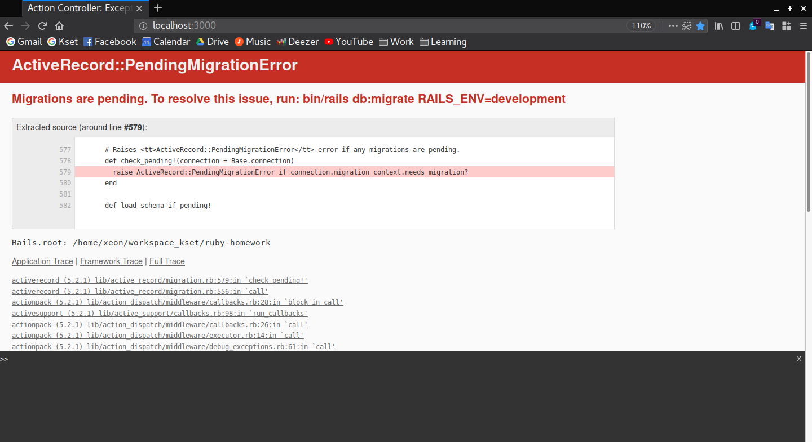

# Ruby on Rails

This is the third chapter in a series of 10 of the
[learn.rb project](https://github.com/monorkin/learn.rb) whose goal is to teach
people Ruby with a focus on Ruby on Rails.

## Chapters

1. [Introduction](#introduction)
   * [Good documentation](#good-documentation)
   * [The main principles](#the-main-principles)
2. [Ruby and the gems](#ruby-and-the-gems)
   * [Installing gems](#installing-gems)
   * [Bundling stuff](#bundling-stuff)
3. [Your first website](#your-first-website)
   * [Generate the project](#enerate-the-project)
   * [See it work](#see-it-work)
4. [Adding index controller](#adding-index-controller)
   * [Using controller generator](#using-controller-generator)
   * [Modifying the controller](#modifying-the-controller)
   * [Changing the view](#changing-the-view)
   * [Making it pretty](#making-it-pretty)
   * [Time for a coffee](#time-for-a-coffee)
5. [Scaffolds](#scaffolds)
6. [Overview of project structure](#overview-of-project-structure)
7. [Assignment](#assignment)

## Introduction

*Learning to build a modern web application is daunting. Ruby on Rails makes it
much easier and more fun. It includes everything you need to build fantastic
applications...* - [rubyonrails.org](https://rubyonrails.org)

Rails is a web framework written for Ruby. This means that when you create a
Rails project like we will today, you will have at your disposal all tools to
display web pages, route users from one page to another, show data you have
stored in database and many many more. 

### Good documentation

To give you a better perspective what are the basic prinicples on which Rails
was designed, take a look on article written by one of its creators -
[The Rails Doctrine by David Heinemeier Hansson](https://rubyonrails.org/doctrine/).
And when you find yourself in a need of a guide or documentation, you can check
out [official guides](https://guides.rubyonrails.org/) which unlike many others 
don't focus on explaining all the components like classes and methods but focus
on solving problems you will encounter on day-to-day basis. And if you are then
still looking for more insight in how things work there is an
[API documentation](https://api.rubyonrails.org/).

### The main principles

With that out of the way let's take a look at two major guidlines for Rails
development:

* **Don't repeat yourself**, there is a specific place for everything. By not
  writing the same information over and over again, our code is more
  maintainable, more extensible, and less buggy.
* Convention over configuration or bluntly said,
  **"You're not a beautiful and unique snowflake"**. In most frameworks there is
  a million of different ways how to do even basic tasks. If you Google a Rails
  problem you probably won't be greated with 20 comletely different solutions to
  your problem on Stack Overflow. You won't have to check which of these
  solutions works best with the rest of your application. There actually is a
  most convinient way how to do a certain thing. This convention means that you
  can make stuff work the way you want very quickly and without knowing how it
  works under the hood.


Rails is a web framework which strongly follows model-view-controller principle.
This principle, as the name suggests, consists of three parts. **Models** are
descriptions of your data objects (eg. post has id, author, date and content).
**Controllers** implement business logic which controlls your application,
accesses data, and forwards stuff to the views and finally **views** are in
charge of showing your page or API result to the users.

## Ruby and gems

If you have some experience with Python, PHP or Node, you might know of pip,
composer or npm. All of these tools are package managers for their respective
programming languages. They help you get all the tools that you need without
copying source code to your project. Package manager for Ruby is called **gem**.

```bash
# Ubuntu/Debian
sudo apt install rubygems

# Fedora/Centos
sudo dnf install rubygems

# On MacOS gem package should be provided with ruby package

# Test your gem package version
gem --version
```

### Installing gems

If you need anything from parsing data, connecting to different databases, or
even using emojis in your code, there is probably a gem for that. Just take look
at the [rubygems website](https://rubygems.org/). You can install gems as easily
as writing `gem install <gemname>`, update them using `gem update <gemname>`
and removing them using `gem uninstall <gemname>`.

Rails is also just a gem and you can easily install it. Just run this block of
code and it will become available on your system.

```bash
# Install rails gem
gem install rails

# Check rails version
rails --version
```

### Bundling gems

But it would be quite boring and against the principle of dont-repeat-yourself
if you'd have to manually install all of the gems every time you checkout a 
project. This is why we have agem called **bundler**. It helps us get all the
gems that we need easily - *One gem to rule them all and in darkness bind them.*
It will read your **Gemfile** file and install all the gems specified in it. You 
can even choose which version of the gem you want. To install the bundler just
run following.

```bash
# Install bundler
gem install bundler
```

And when you want to install new gems or update existing ones you will simply
run `bundle install` or `bundle update`.

Just before we start with the cool stuff make sure that you create a new branch 
and switch to it. You should already know how to do this but just to be sure
here is line by line guide.

```bash
# Navigate to your project foder
cd ~/ruby-homework # for example

# Switch back to master branch
git checkout master

# Pull data from remote to update it
git pull

# Create a new branch
git branch feature/third-assignment

# Switch to that branch
git checkout feature/third-assignment
```

## Your first Rails project

Now that we have Rails, what do we do? We create our first website!

So this is a hard part, right? Nope, it's actually quite easy as Rails packs a
ton of generators which will help you automate creating files and filling them
with boilerplate code. You are here to design how applications work, not to
write useless lines of code.

### Generate the project

```bash
# Move in the folder parent to your repo folder
cd ..

# Create a new Rails application with same name as your repo
rails new ruby-homework

# Don't allow the generator to update your README.md by inputting 'n'

# If you have modified .gitignore, allow it to overwrite with 'y' and after that
# add missing lines eg. .idea or .vscode
```

This will automagically create a backbone of your first Rails web application.
You will also see that it created a Gemfile and run bundler to install a few
gems you might need at the start. We will take a more detailed look at how our
project is organized later but first let's see how our website looks!

### See it work

```bash
# Enter the folder
cd ruby-homework

# Start the server
rails s
```

This will start your Rails server. The default port is 3000 and by default it
binds to localhost. So to open the page, fire up your favorite web browser and
navigate to [localhost:3000](http://localhost:3000). You should be greeted by a
nice graphic and message.



*If this is working, it might not be a bad idea to commit changes. :)*

## Adding index controller

That was nice! Rails took care to create everything for you and already you can
show your first Rails page to friends. But you didn't actually decide what to
show on this page as it was provided for you. Let's create one on our own.
For this we will need a single controller and asociated view.

A controller's purpose is to receive specific requests for the application. 
Routing decides which controller receives which requests. Often, there is more 
than one route to each controller, and different routes can be served by
different actions. Each action's purpose is to collect information to provide it 
to a view. A view's purpose is to display this information in a human readable 
format.

### Using controller generator

To create this mighty pair we will again use a generator. We'll tell it to
generate a new controller called *Landing* as it will serve as a landing on our
page. We will have only one action on that page - *index*. Its role is to index
your website in a way as on landing page user will have list of other pages
he or she can access.

```bash
# Run this 
rails generate controller Landing index
```



What happened here is that rails created a new controller called 
*landing_controler.rb*, view *landing/index.html.erb* and some additional and 
usefull files like controller test, helper, javascript/coffeescript and css
stylesheet. We'll cover exact locations and purpose of these files later but now 
let's take a look at our route, controller and view.

### Modifying the controller

Open `app/controllers/landing_controller.rb` and you might recignize some
stuff - *LandingController* is a class extending the functionality of our
*ApplicationController* you can find in the same folder. It has only one method 
called index which is currently empty. We'll create two local variables. In
first type your favorite dog breed and in the second calculate a simple 
mathematical operation like this.

```ruby
# app/controllers/landing_controller.rb
class LandingController < ApplicationController
  def index
    @dog_breed = 'Irish setter'
    @result = 2 * 2
  end
end
```

### Changing the view

Now open up `app/views/landing/index.html.erb` and take a look.
If you ever encountered HTML source this will at least resemble it. But the file 
extension has additional *.erb* which means that it contains embedded Ruby code. 
By default Rails created a header of most significant importance `<h1>` stating 
the controller and action and a paragraph annotated by `<p>` containing the 
location of the file. Neat! But we want to display our favorite dog breed and 
math solution. We will add a new content division or a `<div>` in short. In it we 
will put some text. To display the data from the controller we will use special
tags `<%= %>`.

This will render Ruby code we put inside of it. So this code should show how
many dogs do you really want to have. Refresh your browser to see the result.

```html
<!-- app/views/landing/index.html.erb -->
<h1>Landing#index</h1>
<p>Find me in app/views/landing/index.html.erb</p>

<div id="dog-div">
    <p class="grow-up">
        When I grow up I'd like to have at least <%= @result %>
        <%= @dog_breed %>s
    </p>
</div>
```

Other neat trick that you will now be able to do is to display generate multiple
page elements like in a loop. You can surround ruby controll logic with `<% %>`
to execute it. Here, we will print what their names would be in an unordered
list `<ul>`. For the number of times we will repeat the same block of code
containing a single list item `<li>`. Take a not that we can also use local
variables like *i* here and execute simple operations.

```html
<!-- app/views/landing/index.html.erb -->
<!-- put this code inside of previous div (dog-div) -->
<ul>
    <% @result.times do |i| %>
        <li>Vilko <%= i + 1 %>.</li>
    <% end %>
</ul>
```

The same pattern goes for writing if then statements. You just have to annotate
`<% if <expression> %>` for the beginning of the block. You can use
`<% elsif <expression> %>` to match multiple criteria and `<% else %>` to catch
the rest of the cases. Just don't forget to add `<% end %>` to the end of the 
block. In this example dog breed is alphabetically compared to some reference 
string. This means that Ruby will compare two strings letter by letter. For 
example *Irish setter* is smaller than *Labrador* and *Maltese* is larger
because of alphabetical order of the first letter. If first two letters were the
same next ones would be compared.

```html
<!-- app/views/landing/index.html.erb -->
<!-- put this code inside of previous div (dog-div) -->
<% if @dog_breed > 'Labrador' %>
    <p><%= @dog_breed %> is alphabetically a large dog</p>
<% else %>
    <p><%= @dog_breed %> is alphabetically a small dog</p>
<% end %>
```

You will again have to refresh the page to show the new results.



*If it works, it might not be a bad idea to commit these changes.*

### Making it pretty

Using controllers and views you can display many thing and controll how the
application works. But as you can see this web doesn't really look that nice.
Maybe we could fix that a bit?

[Bootstrap](http://getbootstrap.com) is an easy to use framework which will help
us make pretty web pages without much effort! To install it we can use gem. Open
`Gemfile` in the root of your project and add `gem 'bootstrap'` to include it to
your project. As Bootstrap depends on jquery, we'll also add it to our Gemfile - 
`gem 'jquery-rails'`. You can put both of the lines before development and test
blocks. Now stop your rails server using Control and C in the terminal it is
running in and bundle our new gems using `bundle install`.

This has added Bootstrap to our project but we still need to include it. Change
extension of `application.css` found in `app/assets/stylesheets` to 
`application.scss` and open the file. Replace the current content with the 
following.

```scss
// app/assets/stylesheets/application.scss
@import "*";
@import 'bootstrap';

body {
    padding-top: 3.5rem;
}
```

Styles from this file are included in all of the pages on your website. This is
therefore a place where you include global imports for styles and where you can
make some global changes. For example we included bootstrap to all pages and
adding padding to the top of our page body. Start the Rails server and refresh
the page. You should notice the space at the top and that text now looks a bit
different.

Just like *application.scss* controlls our styling, `application.html.erb` found
in `app/views/layouts/application.html.erb` is inherited by all other pages. As
we want to add menu to our web we should add it here.

HTML web pages are surrounded by `<html>` tags and consist of two main parts -
head and body. Head contains metadata which helps your web browser display the
page as the developer wanted. In this case, we will tell our browser to follow
the width of your screen and to initially set the zoom level to 1:1 scale.

```html
<!-- app/views/layouts/application.html.erb -->
<!-- <head> Put between body brackets </head> -->
<meta name="viewport" content="width=device-width, initial-scale=1">
```

Bodi is where your content is. So inside of the `<body>` tags add navigation
menu by pasting this snippet. This adds navigation bar to our web with
*hamburger menu* for mobile devices and a single item in the navigation - link
to home.

```html
<!-- app/views/layouts/application.html.erb -->
<!-- <body> Put between body brackets </body> -->
<nav class="navbar navbar-expand-md navbar-dark fixed-top bg-dark">
    <a class="navbar-brand" href="#">Navbar</a>

    <button class="navbar-toggler" type="button" data-toggle="collapse" data-target="#navbarsExampleDefault" aria-controls="navbarsExampleDefault" aria-expanded="false" aria-label="Toggle navigation">
        <span class="navbar-toggler-icon"></span>
    </button>

    <div class="collapse navbar-collapse" id="navbarsExampleDefault">
        <ul class="navbar-nav mr-auto">
            <li class="nav-item">
                <a class="nav-link" href="#">Home</a>
            </li>
        </ul>
    </div>
</nav>
```

Inside of the body tags you will also find `<%= yield %>` which inserts the
specific view like *landing/index.html.rb* in our case. Encapsulate yield like 
this to tells your browser that main content of the website is located here.
After this refresh the page and take a look how the navigation look. If you
make the browser window smaller you should also see that you get a hamburger
menu which is quite useful on mobile phones.

```html
<!-- app/views/layouts/application.html.erb -->
<!-- Still inside body tags -->
<main role="main">
    <%= yield %>
</main>
```

Now we are going to make a few more cosmetical modifications to our landing
page to make it even prettier. Open up `app/views/landing/index.html.erb` and
surround text that was autogenerated (*Landing#index and next paragraph*) with
`<div class="jumbotron">`. This will make it centered and emphasized. Also, 
surround the part that we did in the previous subchapter with
`<div class="container">`. This will center your content so that it is in line
with the previous div. At the end your file should look like this. Now refresh.

```html
<!-- app/views/landing/index.html.erb -->
<div class="jumbotron">
    <h1>Landing#index</h1>
    <p>Find me in app/views/landing/index.html.erb</p>
</div>

<div id="dog-div" class="container">
    <p class="grow-up">
        When I grow up I'd like to have at least <%= @result %>
        <%= @dog_breed %>s and I'd name them like this:
    </p>

    <ul>
        <% @result.times do |i| %>
            <li>Vilko <%= i + 1 %>.</li>
        <% end %>
    </ul>

    <% if @dog_breed > 'Labrador' %>
        <p><%= @dog_breed %> is alphabetically a large dog</p>
    <% else %>
        <p><%= @dog_breed %> is alphabetically a small dog</p>
    <% end %>
</div>
```

Refresh the page now and you will se a quite nice webiste. If you check your
local IP address by writing `ip addr` and put it followed by `:3000` in your
mobile phone web browser you will see that website is also mobile friendly.
Sweet!



If you maybe missed it, when we wrote the view for the landing page index, we
also added an id *dog-div* to the div we added. This is a uniqe identifier for
an element of the web page. When we with CSS tell our browser to change how that
div looks it will immediately know which div it is and change its looks. We also
added class *grow-up* to the first paragraph. Multiple elements can be of same
class and will all be modified when you modify the class.

For example we will now tell our browser to fill the background of the dog-div
with light blue color and to set all elements of class grow-up italic. See that
id is preceded by `#` while classes are annotated by `.` sign. Refresh the
website and see it this changed how it looks. It's not actually improvement in
term of looks but it demonstrates how things work.

```scss
// app/assets/stylesheets/landing.scss
#dog-div {
    background-color: #00008830;
}

.grow-up {
    font-style: italic;
}
```

### Time for a coffee

Probably you are aware of the terms front-end and back-end but let's recap that
just in case. Back-end is in our case Rails application written in Ruby and is
executed on server while front-end files are received by users' web browser and
displayed. In back-end we will fetch and store data as well as control the
application. HTML, CSS and Javascript are front-end technologies and are
executed by the users' web browser. While HTML and CSS are used soley to
describe how website should look, Javascript is a programming language in which
you can do a lot of different stuff - save variables, calculate mathematical
operations, control the program flow using if-then-else or even tell web browser
to make additional calls to the server.

But we will not be writing JavaScript but Coffeescript as it is preferred by
Rails users. Before the server starts, Coffeescript is compiled to Javascript so
that it could be run by the web browsers. Pro of using Coffeescript over
Javascript is that it's less complex to write and can be even faster in runtime.

Just to test how this works open automatically generated file for our landing
page `app/assets/javascripts/landing.coffee`. It is currently empty except for
some comments and we will just for the test add one linee which will write 
a simple message into debug console.

```coffee
# app/assets/javascripts/landing.coffee
console.log "Hi console"
```

Save the file and refresh the browser. You will see oyur web page but there will
be no sign of the log to te console. This output will not show on your terminal
but in the web browsers' console. To access it and many more feature you can in
Firefox right-click on an element you wish to view and then click on
`Inspect element` or just `Inspect` on Chrome.

This will show you the console as well as many more tools. With Inspector you
can for example see all the elements of the page with their attributes. There is
also a simple console you can open and you should see text *Hi console*. This
approach is often used for debugging.



### Adding some pictures

Except for *javascript* and *stylesheets* you also have a folder called
`images` in your `app/assets/` folder. You can place some image assets here.
This will for example be your website logo, header image and other graphical
content.

[//]: # (Add png logo path)

For example we will add an icon to the navigation bar so that users know that
they are looking at our webpage. First we will create a folder 
`app/assets/images/logos` and then copy select an image you want and drop it
there. It might not be a bad idea to use a `.png` file as they can have 
transparency so that your logo can be displayed on multiple different
backgrounds. If you are out of ideas, you can use [this logo](https://TODO).

Now that we have added logo to the project, we need to add it to the navbar
which is found in our `application.html.erb` file. At the begining of it there
is an anchor `<a class="navbar-brand" href="#">` which is basically your
brand logo and text. Before it only wrote *Navbar* if you opened up your browser
but we will now add a logo and a new text. To do this delete the inner text and
add an *image_tag*. Bacause of `<%= %>` you can probably guess that this is a
Rails function that gives you some output. Indeed if you write
`image_tag('logos/learn-rb')`, Ruby will replace this with the path to your
image. We can also add a `<span>` element with some text inside which is
basically an inline text which will be displayed next to our logo. Take look at
the snippet below if you are unsure what to change.

```html
<!-- app/views/layouts/application.html.erb -->
<!-- <nav> Put at the beginning of navigation bar </nav> -->
<a class="navbar-brand" href="#">
    <%= image_tag('logos/learn-rb') %>
    <span>Ruby Homework</span>
</a>
```



If you refresh now you should see that we have a nice logo and text next to our
navigation menu. But it is too big and is overlaping with our text. To make it
smaller we will use the power of CSS. In `application.scss` find the body
section and add a section which will influence of the all elements inside of
`navbar` class. Next, do the same thing with `navbar-brand` class. Now we can tell all img elements found in navbar-brand inside of the navbar to have the
size of *2rem*. We also want our text to be a bit more separated from the logo
so we will also add `padding-left: 0.5rem` to all *span* elements of the navbar.
Refresh the web and see how it looks on both web and mobile.

```scss
// app/assets/stylesheets/application.scss
// Inside of body
.navbar {
    .navbar-brand {
        img {
            height: 2rem;
            width: auto;
        }

        span {
            padding-left: 0.5rem;
        }
    }
}
```



## Scaffolds

As we are creating a simple version of Reddit we want to have authors create
posts on which other authors will be able to add comments. We need to add all of
these models to our Rails application. And for each of those we need to create
controller a fiew views where we could list all members, add new ones or edit
existing ones. To help you avoid writing a lot of boilerplate code, Rails has a 
generator called *scaffold*.

Since we want to have nice user interface without much work we can once again
utilise power of Bootstrap and a little bit of magic from the gem *simple_form*.
To our *Gemfile* we will add `gem 'simple_form'`. To show validation errors when
user for example writes an email that already exist we will also add
`gem 'toastr_rails'`. After this run bundle and additional command to integrate
simple_form with Bootstrap. 

```bash
# Install added gems
bundle install

# Integrate simple_form with bootstrap
rails generate simple_form:install --bootstrap
```

To integrate *toastr* we need to add following lines to our CSS, Javascript and
main application layout.

```bash
# app/assets/stylesheets/application.scss
@import 'toastr_rails';

# app/assets/javascripts/application.js
//= require toastr_rails

# app/views/layouts/application.html.erb
# At the beginning of the <body> section add
<%= render 'toastr_rails/flash'%>
```

Author will have an email, alias and a date of birth. To create the scaffold
first stop the server and then run following command.

```bash
rails generate scaffold Author email:string alias:string date_of_birth:datetime
```

This has generated many thing, many of which we have already seen when
generating the landing page controller. So let's try to see if this actually
worked and refresh our web page.



Seems that we have stumble into error. But no biggie, Rails actually tells you
what is wrong quite literaly - *Migrations are pending. To resolve this issue,
run bin/rails db:migrate RAILS_ENV=development*. This means that we changed how
our data models look in our Rails application but haven't changed that in our
database. To avoid writing querries, Rails generated a migration script for us
and we can just run what we were told. In this case, migration will create a new
database table called Authors with fields we have previously declared.

```bash
rails db:migrate

# == 20181021125009 CreateAuthors: migrating ====================================
# -- create_table(:authors)
#   -> 0.0005s
# == 20181021125009 CreateAuthors: migrated (0.0006s) ===========================
```


```
    invoke  active_record
    create    db/migrate/20181021123409_create_authors.rb
    create    app/models/author.rb
    invoke    test_unit
    create      test/models/author_test.rb
    create      test/fixtures/authors.yml
    invoke  resource_route
    route    resources :authors
    invoke  scaffold_controller
    create    app/controllers/authors_controller.rb
    invoke    erb
    create      app/views/authors
    create      app/views/authors/index.html.erb
    create      app/views/authors/edit.html.erb
    create      app/views/authors/show.html.erb
    create      app/views/authors/new.html.erb
    create      app/views/authors/_form.html.erb
    invoke    test_unit
    create      test/controllers/authors_controller_test.rb
    create      test/system/authors_test.rb
    invoke    helper
    create      app/helpers/authors_helper.rb
    invoke      test_unit
    invoke    jbuilder
    create      app/views/authors/index.json.jbuilder
    create      app/views/authors/show.json.jbuilder
    create      app/views/authors/_author.json.jbuilder
    invoke  assets
    invoke    coffee
    create      app/assets/javascripts/authors.coffee
    invoke    scss
    create      app/assets/stylesheets/authors.scss
    invoke  scss
    create    app/assets/stylesheets/scaffolds.scss
```

## Overview of the rest of the project structure

Now let's look at the rest of the project structure. Open up project folder with
an editor of your choice and take look at the folders that were created for you
when you first run `rails new <projectname>`.


```
app/            - Where your code is
bin/            - Scripts for running your project
config/         - Configuration files
db/             - Everything regarding your database
lib/            - Extended modules for your application
log/            - This is where you find application logs
public/         - Static public stuff like 404 page
test/           - Unit tests and fixtures
tmp/            - Temporary files
vendor/         - Third party code you are directly serving
config.ru       - Tells Rake how to run your application
Gemfile         - List of gems you are using
Gemfile.lock    - Lists current versions of gems with dependancies
package.json    - Npm dependencies of your project
Rakefile        - Allows you to load and run Rake tasks
README.md       - Project description
.gitignore      - Which files should be ignored by git
.ruby-version   - Current ruby version
```

Some of them have already some basic files in them while others are empty except
for the file called `.keep`. Since git doesn't care about folders but only files
it is the only way to tell it to create a folder is to place a file in it. So if
you add some files to your folder `storage`, you can feel free to also delete
the keep file.

### Where your code is - app/

This is most important folder in your project and you'll spend most of your time working in it as it contains models, views and controllers as well as jobs and other assets.

* [Assets](#assets)
* [Channels](#channels)
* [Controllers](#controllers)
* [Helpers](#helpers)
* [Jobs](#jobs)
* [Mailers](#mailers)
* [Models](#models)
* [Views](#views)

#### Assets

This is where you'll put images, javascript files and CSS stylesheets. Basically what makes your web application look good.

We've already mentioned and modified the contents of *javascript* and 
*stylesheets* subfolders. In *Javascript* folder you keep Javascript and/or
Coffeescript files which will be excuted on clients web browser while in 
*Stylesheets* folder you keep your CSS and/or SCSS files which will enhance the
looks of your website.

As you have seen both javascript and stylesheets have a 'main' file which 
includes all of the others and is called *application.js* or *application.scss*.
When server is started or a change in any of the assets files was discovered, 
Rails will automatically compile the assets. This means that user will receive 
only one javascript file called *application.js* and only one stylesheet file
called *application.css*. This is done to optimize the performance of your web.

#### Channels

Channels are used with *Action Cable* component which provides Rails with the
means to create real time applications like chats. Although this component
sounds like a great fun, we'll not be digging into it as it is a bit out of our
scope.

#### Controllers

Bread and butter of your application. They execute most of the logic behind your 
application. You have already created one and you will have another one by the
end of this chapter.

#### Helpers

Sometimes you will need to implement methods which will be often used by many
elements of your view or by multiple different pages. Example of this would be
checking if the students can apply to the course depending on the date. To avoid 
repeating yourself in multiple instances where you will use this function, you
can write a helper method which will do it for you so that you can just write
`if students_can_apply?`.

#### Jobs

Jobs are one-time or a repetitive task which you can manage through Rails. It
uses Active Jobs component. Example of a job would be a function that would go 
through all subscribed users and call a mailer to send a newsletter to each
user.

#### Mailers

Mailers are components which will take a care of sending emails for you and
implemented with Action Mailer component. Using them you can specify name and
email of sender of the email, email to which it will be sent to and layout of
how the email will look.

#### Models


#### Views


## Assignment