# Talking to servers

The goal of this chapter is to teach you how to send data to the server and
how to turn that data into something useful.

In the last chapter we built a web page with authors, posts and comments. In
this chapter we will focus on creating posts and comments.

Let's get started! Start your Rails application from last time with `rails s`,
in the navigation, click on posts. You should see a screen like the following.

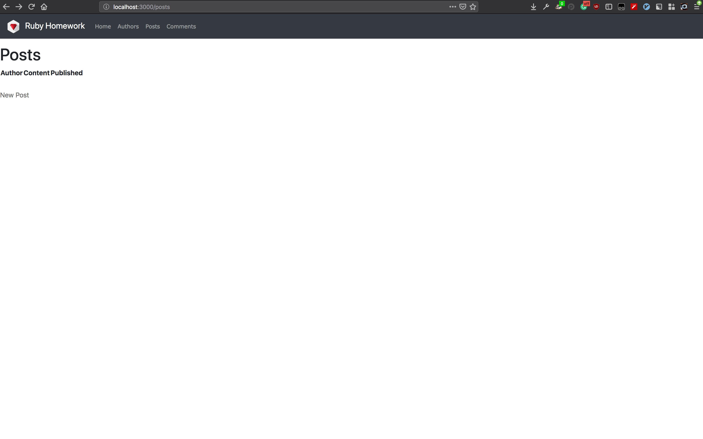

At the bottom, you should see a button named "New Post", click on it and you
should be greeted with the following.

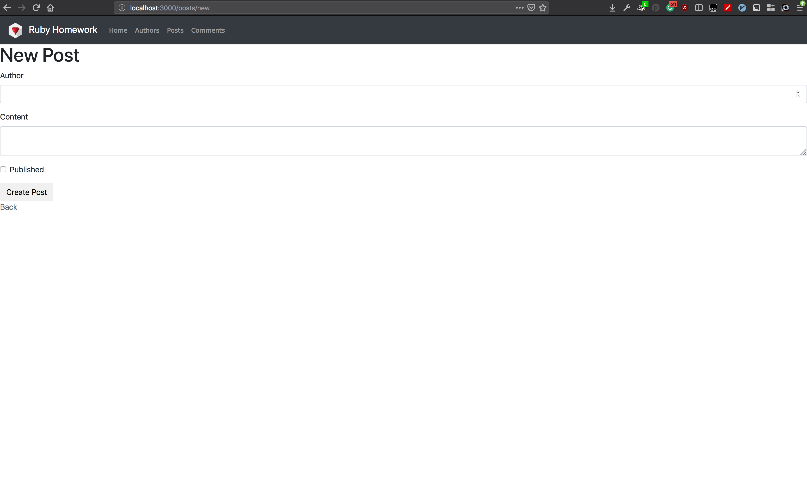

If you now fill out that form and press "Create Post", the screen will flash and
you will be presented with the information you just entered on another screen,
on another URL.

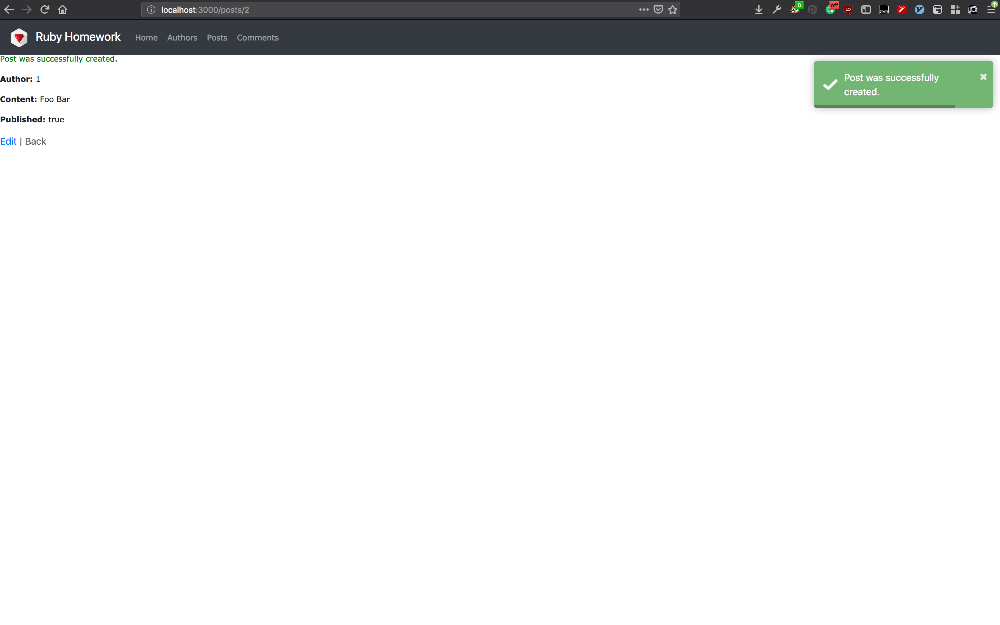

How did we get that data from our browser to the server? This is the focus of
this chapter. Let's take a look at what our browser is doing. Go back to the
posts screen, and click on "New Post" again. Now fill out the form with
different data, right-click on any field and select "Inspect" or
"Inspect Element" from the drop down menu. You screen should split in half
either horizontally or vertically. This window is called the inspector.

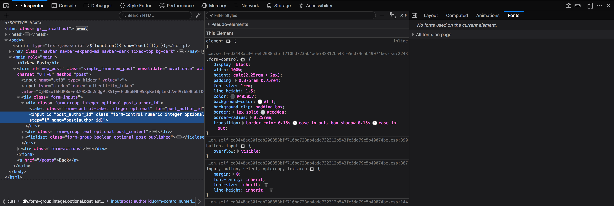

You should see a couple of tabs at the top of the new window. One should be
"Network", select it. There should be a "Persist Logs" of "Preserve Logs"
check box, if it's unchecked, check it.

Now press "Create Post"!

The following should appear.

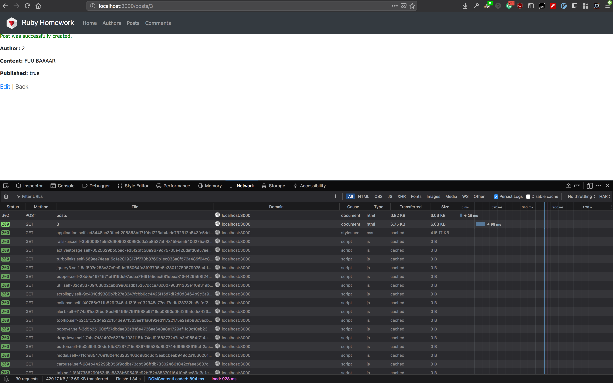

There should be a lot of entries in the network tab now. Scroll up until you
find one that begins with `POST`, click on it and your inspector should split
in half. In the new panel you should see data related to that particular
request. Here we can see exactly what our browser sent to our server when we
clicked "Create Post".

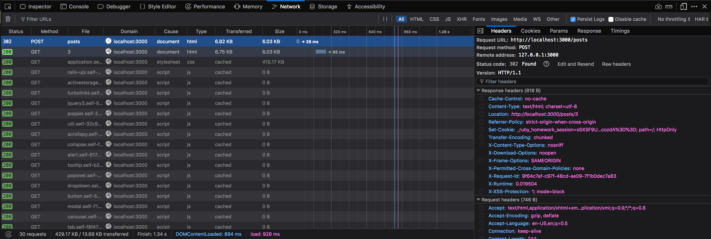

If we now click on the "Params" tab. We can see which data was sent!

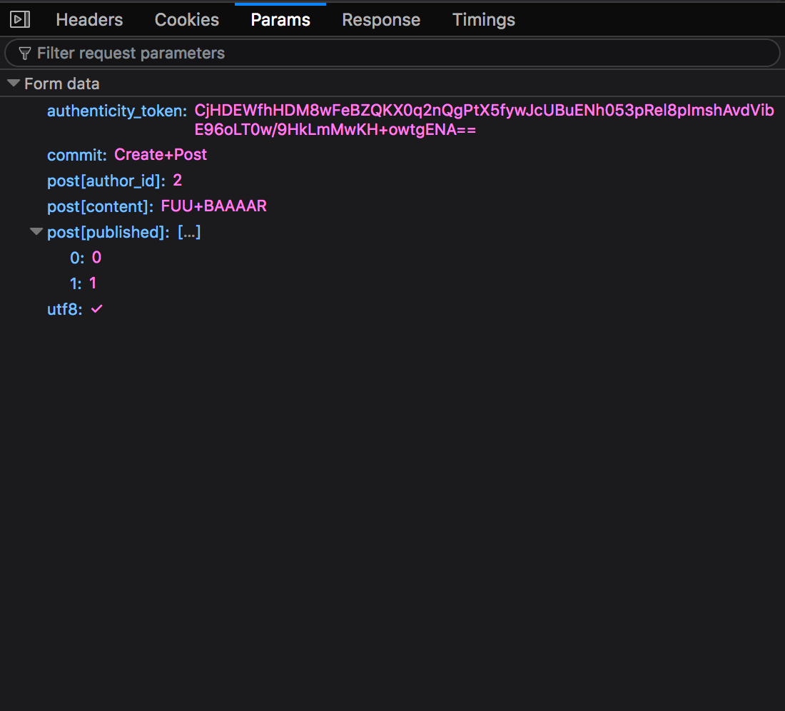

Here we can see all the data associated with our post. That data is prefixed
with `post` and the attributes name is within square brackets `[]`. There are
three additional fields - `authenticity_token`, `commit` and `utf8`. Of those
three `commit` is something the browser added by its self, while Rails added
`authenticity_token` and `utf8`. Those two fields are used to enhance the
security of our application - they protect us and our users from
malicious actors that try to steal or manipulate data. Let's ignore those
fields for now and focus on the `post[]` fields. This encoding is done by
the form it self.

Forms are used to gather a user's input, like text, numbers or files, and send
them to the server to be stored or processed. They are the most basic way to
talk to servers. In a later chapter we will learn about more ways in which
we can communicate with our server.

Let's try to create our own form! We will make a form that solves second
degree polynomials.

Before we begin we need to know how to solve those polynomials! All second
degree polynomials follow this form `a * x^2 + b * x + c = d`. You may notice
that we can eliminate the `d` variable by moving it to the other side so that
we get `c - d` - which we can simply call `c` as it's just another variable.
The general solution to those kinds of problems is
`x = (-1 * b +- sqrt(b ^ 2 - 4 * a * c)) / (2 * a)`.

Ok. To solve those polynomials we need a view to gather 4 variables from
our user, we need a controller to process the data and another view to display
the result.

We'll start with the controller. Navigate to `app/controllers` and create a new
controller named `polynomials_controller.rb` with the following content.

```ruby
# app/controllers/polynomials_controller.rb

class PolynomialsController < ApplicationController
  def show
  end

  def new
  end

  def create
  end
end
```

This enables the controller to process three types of REST requests:

1. Show - A `GET` request to `/polynomials/4,3,2` that displays the result
2. New - A `GET` request to `/polynomials/new` that requests the user's input
3. Create - A `POST` request to `/polynomials` that submits the user's input to the server

Now, let's move to the `new` method and create it's view - in other words the
form that will gather the user's input. Create two new empty files at
`app/views/polynomials/new.html.erb` and `app/views/polynomials/show.html.erb`.

To be able to view what we did so far we need to create routes for our new
controller. Instead of using `resources` as we did in the last chapter, this
time we will create all routes by hand. Open the `config/routes.rb` file.
First, we will create the `show` REST method, for that we need a route that
responds to `GET` on `/polynomials` and ends with a id like `4,3,2` or
something similar.

The Rails router allows us to create routes that correspond to HTTP `GET`
methods by using the `get` method and passing it the name of the route we want
in addition with an indicator to the controller and method we want to call when
a request for this route comes in. Indicator have the following syntax -
`controller_name#method`, so in this case our indicator would be
`polynomials#show`. We also need a dynamic part in our path as we want to use
everything after `polynomials/` as an `id` of the polynomial. The rails router
allows us to specify dynamic parts by prefix the part's desired name with a
colon `:` - e.g. `polynomials/:id`.

To put it all together, our method call would be
`get 'polynomials/:id', to: 'polynomials#show'`

The router supports methods for all HTTP method types - `get`, `post`, `delete`,
`put` and `patch`. Using them we can create the remaining two methods:

* `get 'polynomials/new', to: 'polynomials#new'`
* `post 'polynomials', to: 'polynomials#create'`

Just be sure to define the `polynomials/new` route before the `polynomials/:id`
route as otherwise Rails will think that `new` is an `id` while visiting
`polynomials/new` and would always call the `show` method instead of the
`new` method.

```ruby
Rails.application.routes.draw do
  root 'landing#index'

  resources :comments
  resources :posts
  resources :authors

  get 'polynomials/new', to: 'polynomials#new'   # <-- WE ADDED
  get 'polynomials/:id', to: 'polynomials#show'  # <-- THESE
  post 'polynomials', to: 'polynomials#create'   # <-- LINES
end
```

Now open the following URL in your browser
`http://localhost:3000/polynomials/new` and you should be greeted with a blank
screen.

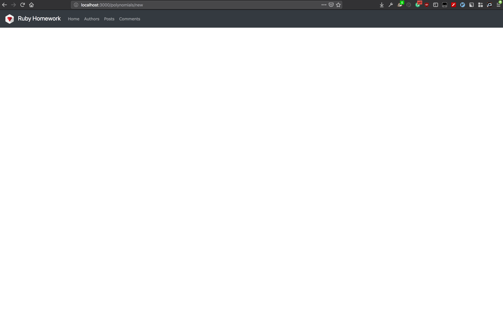

Let's change this! Open up `app/views/polynomials/new.html.erb`.

First let's create a large title using the `<h1>` tag. There are many header
tags raging from `h1` to `h7` - 1 is the biggest one and 7 is the smallest.
Our header tag should look like `<h1>Solve a polynomial!</h1>`.

Now we need a form! In the last chapter we saw that Rails provides shorthand
methods for creating forms. We won't use them here as they're mostly useful
when working with models - this will be covered in a later chapter.

To create our form we will use the `form` tag and set it's `action` attribute
to our `create` method's route - `/polynomials`, and set it's `method`
attribute to `POST`.

```html
<h1>Solve a polynomial!</h1>

<form action="/polynomials" method="POST">

</form>
```

But we are missing a way to submit our form. For this we just need to add a
button like the following `<button type="submit">Solve!</button>` into the form.

```html
<h1>Solve a polynomial!</h1>

<form action="/polynomials" method="POST">
  <button type="submit">Solve!</button>
</form>
```

Now we need to create inputs for our variables. We can use the `input` tag for
this! Every input has to have a `name` attribute by which the server can read
the value, and a `type` attribute which tells your browser how to render the
input. So a variable input may look like the following
`<input type="number" name="a" \>`. Since we specified that the value of the
input is a number, the browser will automatically validate that the entered
value is a number and show an appropriate message if it isn't.

```html
<h1>Solve a polynomial!</h1>

<form action="/polynomials">
  <p>a * X^2 + b * X + c = d</p>

  <p>
    <label for="a">a:</label>
    <input type="number" name="a" \>
  </p>
  <p>
    <label for="b">b:</label>
    <input type="number" name="b" \>
  </p>
  <p>
    <label for="c">c:</label>
    <input type="number" name="c" \>
  </p>
  <p>
    <label for="d">d:</label>
    <input type="number" name="d" \>
  </p>

  <button type="submit">Solve!</button>
</form>
```

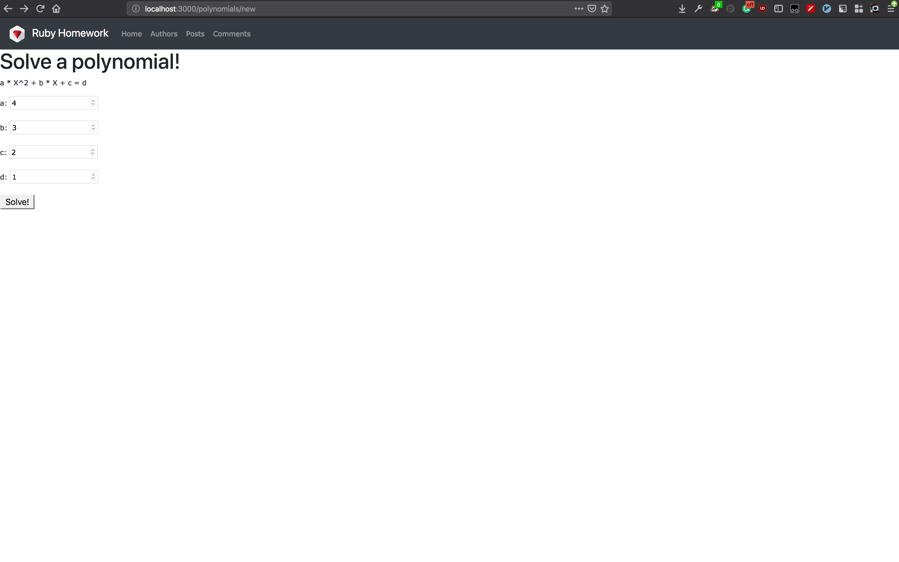

But if we enter some number and press the submit button we get an error!?

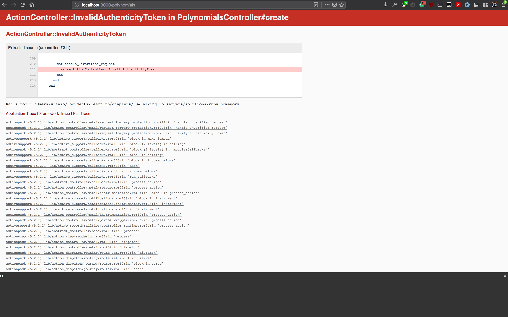

Remember the two additional fields that Rails added to our form? Well, we
are missing the as we created our form by hand. Specifically, this error is
raised because we are missing the `authenticity_token` input. While we could
just add it it wouldn't solve our problem as rails expects it to be set to
a predetermined random value, we simply don't know. But! We can use Rails to
add it to our form auto-magically by calling `<%= form_authenticity_token %>`.
So we can add `<input name="authenticity_token" type="hidden" value="<%= form_authenticity_token %>" \>`
to our form to solve this issue. Here we used the `hidden` field type as we
don't want the user to see it or to interact with it. We used the `value`
attribute to pre-set the input's value to our authenticity token.

```erb
<h1>Solve a polynomial!</h1>

<form action="/polynomials" method="POST">
  <p><b>a</b> * X<sup>2</sup> + <b>b</b> * X + <b>c</b> = <b>d</b></p>

  <p>
    <label for="a">a:</label>
    <input type="number" name="a" \>
  </p>
  <p>
    <label for="b">b:</label>
    <input type="number" name="b" \>
  </p>
  <p>
    <label for="c">c:</label>
    <input type="number" name="c" \>
  </p>
  <p>
    <label for="d">d:</label>
    <input type="number" name="d" \>
  </p>

  <input name="authenticity_token" type="hidden" value="<%= form_authenticity_token %>" \>

  <button type="submit">Solve!</button>
</form>
```

And that's it! We made a form completely from scratch! If you are still
interested as to why we need the `authenticity_token` input and why
it has to be a specific value you can read into it by searching for
Cross Site Request Forgery, or CSRF for short.

Let's now go back to the controller and use the data that we sent via the form.
To access data sent to the server we use the `params` object which is
present in all Rails controllers. It looks and feels much like a regular hash
but has additional features that we will cover in the next chapter. For
now we can think of it and use it just like a hash.

We could implement the solution finding algorithm in the following manner:

```ruby
def create
  a = params[:a].to_i
  b = params[:b].to_i
  c = params[:c].to_i
  d = params[:d].to_i

  solution = solve(a, b, c, d)
  solution = Marshal.dump(solution)
  solution = Base64.encode64(solution)

  redirect_to "/polynomials/#{solution}"
end

def solve(a, b, c, d)
  require 'cmath'

  a = a.to_r
  b = b.to_r
  c = (c - d).to_r

  first = -1 * b
  second = CMath.sqrt(b**2 - 4 * a * c) / (2 * a)

  [first - second, first + second]
end
```

There are a few tricky parts here. First is the `to_r` it converts any number
to a rational number this is important because second degree polynomials have
solutions with imaginary components. Then there is `CMath` it allows us to
find imaginary roots of numbers, the regular `Math` root method throws an
error if the input is negative. Finally there is `redirect_to` which you saw
in the previous chapter. It redirects the user to the show page with the
solution. But our solution is an array of two imaginary numbers! The
browser can't understand that, therefor we use `Marshall` and `Base64`
to convert it to a `String` the browser understands. `Marshall` converts Ruby
objects to a compact binary-format or in layman's terms - to ones and zeroes.
While `Base64` converts the ones and zeroes to letters.

Now we have to do the same, but in reverse, in the show method to get the
solutions out of the id.

```ruby
def show
  @solution = params[:id]
  @solution = Base64.decode64(@solution)
  @solution = Marshal.restore(@solution)
end
```

Notice that we used an instance variable. We learned in the last chapter that,
using them, we can pass values from the controller into the view.

Finally we can do the show view:

```html
<h1>The solutions!</h1>

<h2>1. <%= @solution.first %></h2>
<h2>2. <%= @solution.last %></h2>
```

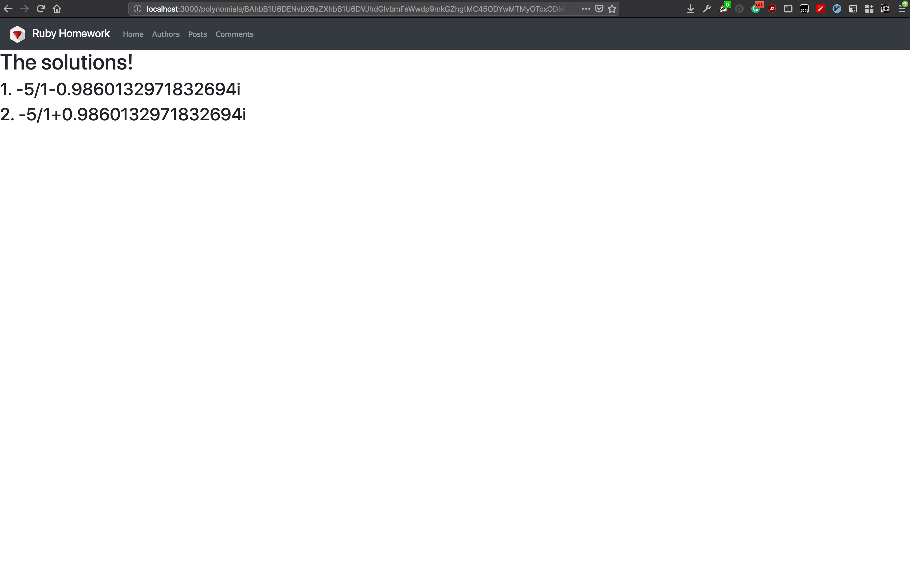

It only prints out the first and the second solution to the problem. Nothing
to write home about. But with this we have a fully functioning polynomial
solution finder written completely by hand! This was a learning experience, but
we still have open questions! Why did Rails prefix the input's names with `post`
and put the real name in brackets?

Ha! Rails does something very cool here, it builds a sub-hash. A form can
contain many different inputs for many different contexts, not to mix them up
we can put them in sub-hashes. E.g.:

```html
<form action="/buildings" method="POST">
  <p>
    <label for="manager[name]">Manager name:</label>
    <input type="text" name="manager[name]" \>
  </p>
  <p>
    <label for="manager[phone]">Manager phone:</label>
    <input type="text" name="manager[phone]" \>
  </p>
  <p>
    <label for="building[address]">Building address</label>
    <input type="text" name="building[address]" \>
  </p>
  <p>
    <label for="building[name]">Building name</label>
    <input type="text" name="building[name]" \>
  </p>

  <input name="authenticity_token" type="hidden" value="<%= form_authenticity_token %>" \>

  <button type="submit">Save!</button>
</form>
```

Would give us the following `params` object:

```ruby
{
  manager: {
    name: "John Doe",
    phone: "+112345678"
  },
  building: {
    address: "1 Somewhere St., 00000 Somewheresville, Somewhere",
    name: "ACME Corp Headquaters"
  }
}
```

We can also store arrays in a similar manner. By using empty brackets `[]` we
tell Rails that we want duplicates to be handled like members of an `Array`.
Otherwise if multiple fields with the same name are sent to the server only the
last will be used.

```html
<form action="/competitions" method="POST">
  <p>
    <label for="participant[name][]">1st place:</label>
    <input type="text" name="participant[name][]" \>
  </p>
  <p>
    <label for="participant[name][]">2nd place:</label>
    <input type="text" name="participant[name][]" \>
  </p>
  <p>
    <label for="participant[name][]">3rd place:</label>
    <input type="text" name="participant[name][]" \>
  </p>

  <input name="authenticity_token" type="hidden" value="<%= form_authenticity_token %>" \>

  <button type="submit">Save!</button>
</form>
```

Gives us the following `params` object:

```ruby
{
  participant: {
    name: [
      "Alice",
      "Bob",
      "Clay"
    ]
  }
}
```
