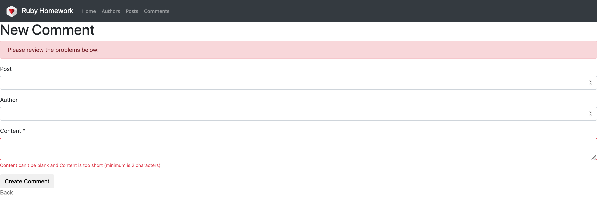
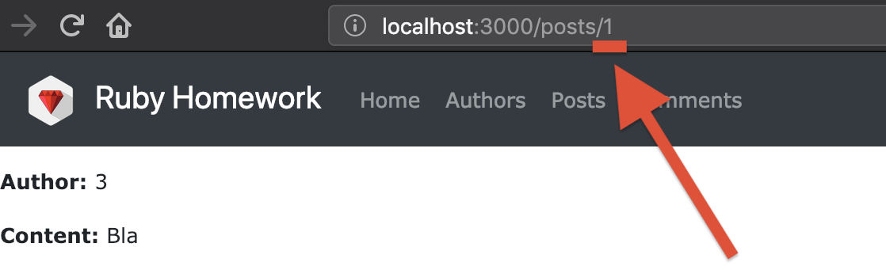

# Working with databases, or how to remember stuff

## Chapters

1. [Introduction](#introduction)
2. [The model](#the-model)
    * [Representing state](#representing-state)
    * [Types](#types)
    * [Attributes](#attributes)
    * [Validation](#validation)
    * [Creating](#creating)
    * [Updating](#updating)
    * [Deleting](#deleting)
3. [Migrations](#migrations)
    * [A history of changes](#a-history-of-changes)
    * [Create](#create)
    * [Update](#update)
    * [Destroy](#destroy)
    * [Reversibility](#reversibility)
4. [Associations](#associations)
5. [Querying](#querying)
    * [Find & find_by](#find--find_by)
    * [All & where](#all--where)
    * [Join](#join)
    * [Order_by](#order_by)
6. [Indices](#indices)
7. [Assignment](#assignment)

## Introduction

When working with web applications, or any other application for that matter,
we will need a way to store and retrieve data. Looking back at our first
example, the Employee-o-matic 4000, all our applications lost all the data
we entered into them upon restart. This happened because we stored that data
in the memory of the process / application. In simple words, we were using
your computer's RAM to store the data, and as soon as the Ruby process stopped
your computer freed the RAM and thus the data was lost.

There are many ways to store data on the file system, but we are going to focus
only on so-called "relational database systems" - also known as SQL databases.
Of all available SQL databases we will only look at two - SQLite and Postgres.

SQLite is the system we used in the last couple of lectures. It's the simplest
SQL database system there is. It stores everything in a single file. This
simplicity causes many complications, which won't be covered here, that makes
SQLite not suitable for real-world applications. But it's perfect for
testing and development!

## The model

Ruby on Rails implements an architecture known as Model, View, Controller.
In the previous chapters we focused mostly on Views and Controllers, in this
chapter we will focus on Models.

### Representing state

In an MVC (Model View Controller) architecture the Model represents the
application's state. That means it represents all entries for all kinds of data
there is, or at least that's persisted.

Relational database systems (RDB for short) store data in tables. Tables are
very much alike tables from your favorite office suite. They have rows, columns
and headers. By convention, columns represent individual fields of each record
we want to store, while rows represent a single record. This might be confusing
at first, so let me give a visual example.

```text
                    People
+------------+-----------+----------------------+
| First name | Last name |         Email        |
+------------+-----------+----------------------+
| Alice      | Cage      | alice.cage@gmail.com |
| Bob        | Ross      | bob.ross@ymail.com   |
| Clemens    | Smith     | clemence.smith@yn.ru |
| Dorian     | Gray      | dorian.gray@aol.com  |
+------------+-----------+----------------------+
```

In the table above, we store each person in a separate row while individual
fields associated with each person are stored in columns. E.g. The first row
represents the person Alice Cage with the email alice.cage@gmail.com.

To be able to show all the people we have in our database we need to create a
model for that table. A **instance** of a model represents a single row of the
table, in other words a single person or record. While a model **class**
represents the whole table. This will become important later on.

Models live in the `app/models` directory. If you navigate there now you will
see the author, comment and post models we created in the previous chapters.

If you open any of these models you will notice that the file is nearly empty.
To help us see the fields that our models hold we can use a tool called
`annotate`.

To install it run `gem install annotate`.

```bash
$ gem install annotate
Fetching: annotate-2.7.4.gem (100%)
Successfully installed annotate-2.7.4
1 gem installed
```

To use it, move to the root of your ruby_homework directory and run the
following

```bash
$ annotate
Annotated (9): app/models/author.rb, test/models/author_test.rb,
test/fixtures/authors.yml, app/models/comment.rb, test/models/comment_test.rb,
test/fixtures/comments.yml, app/models/post.rb, test/models/post_test.rb,
test/fixtures/posts.yml
```

If you now open any of your models it should have something similar to the
following at the start of the file.

```ruby
# == Schema Information
#
# Table name: posts
#
#  id         :integer          not null, primary key
#  author_id  :integer
#  content    :text
#  published  :boolean
#  created_at :datetime         not null
#  updated_at :datetime         not null
#

class Post < ApplicationRecord
end
```

Annotate is a tool that copies information form the database over to the model
so that we can see it instead of having to remember it. The structure
is displayed as a comment at the beginning of the file starting with the
table name and followed by the table's columns. The column's data is grouped
into three columns - name, type, attributes. For now pay attention only to the
name and type, we will cover attributes later.

### Types

The most glaring thing here is the types column. In Ruby we don't have to think
about types. But a RDB isn't Ruby. When it comes to storing data, types are
advantageous! We as humans created types as an analogy to what we do in nature.
Take yourself as an example. Every time you clean or tidy your room you put
things of the same type together - socks go with socks, pants with pants,
papers with papers, ... You don't have to do that, but you do because it
makes your life easer later as you can quickly find something you are looking
for, and it would be confusing to find toothpaste between a few sheets of paper.
For all the same reasons, except the toothpaste part, most RDB systems use
types.

Most RDBs differentiate at least the following types - string (aka. varchar),
integer (whole number), float (decimal number), boolean (true / false value) and
text (very long string). Postgres additionally has
jsonb (indexable JSON fields), point (2D point), array (a list of values),
and many more, as well as the ability to create custom types.

Types enable us to convey meaning to the field. E.g. a if a field is named
"default" and its type is boolean we know it indicates if the record is the
default record, while in ruby we would have to name the field "default_record"
or "is_defualt" to convey the same meaning.

In most RDBs every field can only be it's specified tye or `NULL`. `NULL` is a
special value that represents the absence of data. It has all the same use-cases
as `nil` does in Ruby and it behaves much like `nil` in the sense that `NULL` is
basically the same as `false` in most cases.

### Attributes

Now let's cover attributes! In this course we will only use three attributes -
`not null`, `default` and `primary key`.

A `primary key` is the field by which
the whole row can be uniquely identified. In the people table from before the
primary key would be the `Email` field, as there can be multiple people sharing
the same first name or last name or both, but each person has an unique email
address which differentiates them from all others sharing the same name. In
Rails the default primary key is a column named `id` which is an integer that
starts at `1` and automatically (and only) increments with each record.

The `default` attribute set's the default column value if no value is set by the
user. E.g. if you create a model to represent your user you would need a way to
differentiate if the user is an admin or not. To do that you would add an
`admin` field/column to the user model and set it's default value to `false` so
that, if not otherwise specified, no user would accidentally become an admin.
Or, if you are a psychopath, you could set the default value for the first_name
column to "Garry" so that everybody that doesn't enter their name would become
"Garry".

Finally there is `not null` and it does exaclty what you think it does. It
prohibits a column to have the value `NULL` this is useful for storing
obligatory fields such as `email` because the database would refuse to store
a person without their email.

### Validation

When we specify that a column in the database is `not null` that validation is
handled by the database itself. The problem with this approach is that our
application will raise an exception if the user leaves a `non null` field empty.

Take for example the comments field we worked on in the previous chapter.
We don't want to allow users to post empty comments. To accomplish this we
need to add the `not null` attribute to it. The process to do this will be
covered later on, for argument's sake let's assume that we did that. If a user
posts an empty comment we wouldn't want to display them with an error screen,
it would be better to redirect them back to the form, mark the comment field
red and print the error under the field. To accomplish this we need to track
the errors the database returns. Rails can do that for us using the
`validates` method!

For our comments, it would be good not only to validate if some text is present
(because the user could submit an empty string), but also to validate the
length of the text the user entered. Let's say that a comment has to have at
least two letters. To accomplish this we can write the following.

```ruby
# == Schema Information
#
# Table name: comments
#
#  id         :integer          not null, primary key
#  post_id    :integer
#  author_id  :integer
#  content    :text
#  created_at :datetime         not null
#  updated_at :datetime         not null
#

class Comment < ApplicationRecord
  validates :content, presence: true, length: { minimum: 2 }
end
```

Now if we try to create a new comment and leave the content field empty we
should see the following.



We get this kind of error handling for free by using simple form. Also, notice
that the content field got an astrix `*` next to it indicate the field is
mandatory.

The `validates` method expects the name of the column as the first argument
and as many validation conditions as you need. The full list of all
validations is available on
[guides.rubyonrails.org](https://guides.rubyonrails.org/active_record_validations.html#validation-helpers).

### Creating

Remember that earlier on we mentioned that there is a difference between an
instance of a model and the class of a model in respects to what they represent.
The instance represents a single row in a database table, while the class
represents the whole table.

Given the people table from before.

```text
                    People
+------------+-----------+----------------------+
| First name | Last name |         Email        |
+------------+-----------+----------------------+
| Alice      | Cage      | alice.cage@gmail.com |
| Bob        | Ross      | bob.ross@ymail.com   |
| Clemens    | Smith     | clemence.smith@yn.ru |
| Dorian     | Gray      | dorian.gray@aol.com  |
+------------+-----------+----------------------+
```

It would map to a model named `Person`. This is the convention in Ruby on Rails.
A model has the singular name of the table it represents, and in SQL databases
it's convention to always name tables in plural form. E.g. a table who's row
represents a person would be named `people`, and the corresponding model would
be named `person`. If you follow this convention Rails will handle everything
automatically for you. It's possible to stray away from this convention but then
many things have to be dialed in manually.

Let's say that we are given an empty `people` table.

```text
                    People
+------------+-----------+----------------------+
| First name | Last name |         Email        |
+------------+-----------+----------------------+
+------------+-----------+----------------------+
```

How are we supposed to create a new person? There are two ways to do this. The
more Ruby-like way is to simply create a new instance of the model using the
`new` method. So let's try that.

```ruby
person = Person.new
person.first_name = 'Alice'
person.last_name = 'Cage'
person.email = 'alice.cage@gmail.com'
```

If we would now look into our database we would see the following.

```text
                    People
+------------+-----------+----------------------+
| First name | Last name |         Email        |
+------------+-----------+----------------------+
+------------+-----------+----------------------+
```

What now!? But we create a new instance and gave it data! And we said that this
should work! Well, this is a kink of how RDBs work. RDBs handle data changes in
increments called transactions. Transactions which insert or update data are
really intensive on the database and therefore we want to have as few of them
as possible. Therefore Rails has the `save` method, which will save our
instance to the database. Let's try it.

```ruby
person = Person.new
person.first_name = 'Alice'
person.last_name = 'Cage'
person.email = 'alice.cage@gmail.com'
person.save # => true
```

And now our database looks like

```text
                    People
+------------+-----------+----------------------+
| First name | Last name |         Email        |
+------------+-----------+----------------------+
| Alice      | Cage      | alice.cage@gmail.com |
+------------+-----------+----------------------+
```

The `save` method can return either `true` or `false` depending on if the
transaction failed or not. A common reason for a transaction to fail would be
validations. If the `save` method would return `false` and we had a validation
that required all users to be named `Garry` (you psychopath) then our
`person` object's `error` attribute would have a value like the following

```
person.save # => false
person.errors # => #<ActiveModel::Errors:0x007fa35f4c72a0 @base=#<Person id: nil, first_name: 'Alice', last_name: 'Cage', email: 'alice.cage@gmail.com', created_at: nil, updated_at: nil>, @messages={:name=>["must be 'Garry'"]}, @details={:first_name=>[{:error=>:equal}]}>
```

It's good to note that there also exists a `valid?` method which returns `true`
or `false` depending on wether or not the record is valid. And it also sets the
`errors` attribute.

The other way of creating records is using the `create` method on the model.
This is the RDB way of doing things. Most RDBs use a language called SQL to
interact with them, and in it an insert is done by referencing the table where
you are inserting in the following manner.

```SQL
INSERT INTO people (first_name, last_name, email) VALUES ('Alice', 'Cage', 'alice.cage@gmail.com');
```

The important part here is the `INSERT INTO people`. To mimic this Rails
implements the `create` method as follows.

```ruby
Person.create(
  first_name: 'Alice',
  last_name: 'Cage',
  email: 'alice.cage@gmail.com'
)
```

To get the same error handling functionality we had with the `save` method the
`create` method returns an instance of the model. E.g.

```ruby
person = Person.create(
  first_name: 'Alice',
  last_name: 'Cage',
  email: 'alice.cage@gmail.com'
) # => #<Person id: nil, first_name: 'Alice', last_name: 'Cage', email: 'alice.cage@gmail.com', created_at: nil, inserted_at: nil>

person.errors # => #<ActiveModel::Errors:0x007fa35f4c72a0 @base=#<Person id: nil, first_name: 'Alice', last_name: 'Cage', email: 'alice.cage@gmail.com', created_at: nil, updated_at: nil>, @messages={:name=>["must be 'Garry'"]}, @details={:first_name=>[{:error=>:equal}]}>
```

The best part is that the `create` and `save` methods aren't exclusive! You
can mix and match them however you like.

```ruby
person = Person.create(
  first_name: 'Alice',
  last_name: 'Cage',
  email: 'alice.cage@gmail.com'
) # => #<Person id: nil, first_name: 'Alice', last_name: 'Cage', email: 'alice.cage@gmail.com', created_at: nil, inserted_at: nil>

person.errors # => #<ActiveModel::Errors:0x007fa35f4c72a0 @base=#<Person id: nil, first_name: 'Alice', last_name: 'Cage', email: 'alice.cage@gmail.com', created_at: nil, updated_at: nil>, @messages={:name=>["must be 'Garry'"]}, @details={:first_name=>[{:error=>:equal}]}>

person.first_name = 'Garry' # => #<Person id: nil, first_name: 'Garry', last_name: 'Cage', email: 'alice.cage@gmail.com', created_at: nil, inserted_at: nil>

person.save # => true
```

### Updating

Alice just called and invited us to her wedding! She is getting married to
someone surnamed Dent, we'll need to update our record in the database to
avoid embarrassing emails.

In Rails, updating a record can be done in two ways. Either by changing the
value of an attribute and calling `save` (as shown in the previous example) or
by calling the `update` method on the instance.

Since we are familiar with the first aproach let's take a look at the second.

```ruby
person = Person.create(
  first_name: 'Alice',
  last_name: 'Cage',
  email: 'alice.cage@gmail.com'
) # => #<Person id: nil, first_name: 'Alice', last_name: 'Cage', email: 'alice.cage@gmail.com', created_at: nil, inserted_at: nil>

person.errors # => #<ActiveModel::Errors:0x007fa35f4c72a0 @base=#<Person id: nil, first_name: 'Alice', last_name: 'Cage', email: 'alice.cage@gmail.com', created_at: nil, updated_at: nil>, @messages={:name=>["must be 'Garry'"]}, @details={:first_name=>[{:error=>:equal}]}>

person.update(first_name: 'Garry') # => true
```

The `update` method works quite similar to the `save` method, but it accepts
a hash with the desired attribute changes in it. When working with web
applications the `update` method is fare more practical as we can pass it the
params we received from the user, instead of having to iterate through all the
values and assign them to attributes individually.

### Deleting

Finally (pun intended) we need to cover deletion. In Rails, deletion is done
using the `destroy` method. Yes, a bit confusing - everybody expects delete, but
it's destroy. I expect that there is an interesting reason for this, but I'm not
aware of any rationale behind this decision.

The `destroy` method, much like the `save` and `update` method before it,
returns only true or false. And can be used in the following way.

```ruby
person.destroy # => true
```

## Migrations

We covered how to Create, Update and Destroy records in our database tables
through the use of models. But how do we create tables in our database? In Rails
we create, modify and destroy tables through migrations.

The word migration is an odd choice for something that manipulates your
database. The creators of Rails thought of the database in term of it's schema.
A database schema is much like a blueprint that contains all the plans for how
your tables should look like. A schema is not a physical thing, it doesn't
exist per se, but it's a concept or idea of how to describe your database. So
a migration moves the old concept of your database to the new one.

By now you have created a few migrations just by following the last
chapters. You can view all your migrations by navigating to `app/db/migrate` you
should have three files in this directory.

All migration files follow this naming scheme:

```text
20181028160427_create_authors.rb
```

Basically it's a bunch of numbers followed by a human readable name. The numbers
represent the time the file was created. If you look carefully you will notice
that the format of the numbers is `YYYYMMDDHHmmSS` where `Y` is the current
year, `M` is the current month, `D` is the current day, `H` the hour, `m` the
minute and `S` the second. And the human readable part is just something
descriptive about what the migration does to your database. While confusing,
this naming convention is quite helpful when working with others.

You can apply all your migrations to the database by running

```bash
rails db:migrate
```

This will go through your migrations, find any that haven't yet been applied
yo your database and apply them.

### A history of changes

Unlike any other code, we will never change or delete migration files. We will
only ever create new ones.

Your migration files represent the history of your database, or at least the
changes it went through. And, as with any good time-travel movie, history should
never change for it could cause unforeseen consequences.

If we ever want to change something we already migrated, we would create a new
migration that applies our desired change. This might not always be easy, but
it will always be consistent.

### Create

We can create a new migration by executing one of the following commands
in our shell.

```bash
rails g migration create_sub_reddit
```

This kind of migration creation is mostly used for updating the schema, so it
will be covered in the next chapter.

The other way to create a migration is through creating a model. As we stated
before, a model represents a table in our database. So by creating one, Rails
will create a migration that creates the table.

```bash
rails g model sub_reddit title:string description:text private:boolean owner_id:integer
```

The first argument is the name of the model, it can either be in singular or
in plural, all other arguments are names of the columns the table should have
separated from their type by a colon `:`.

This command will do quite a lot. It will create a migration, a model, and a few
other files we will cover later.

Let's take a look at the generated migration.

```ruby
class CreateSubReddit < ActiveRecord::Migration[5.2]
  def change
    create_table :sub_reddits do |t|
      t.integer :owner_id
      t.text :description
      t.text :title
      t.boolean :private

      t.timestamps
    end
  end
end
```

It generated a file containing a single class with the method `change` in it.
Inside the `change` method, the `create_table` method is called with a
symbol `:posts` and a block of code. The symbol is the name of the table we
want to create, while the block of code defines the table's columns.

We can change the block of code to add any attributes we would like. Let's
make the default `private` value `false` and prohibit it from being `null`.
As it makes sense for that field to be unambiguous, it should be
either `true` or `false` and it should be `false` be default as we want engage
people to create public sub reddits.

```ruby
class CreateSubReddit < ActiveRecord::Migration[5.2]
  def change
    create_table :sub_reddits do |t|
      t.integer :owner_id
      t.text :description
      t.text :title
      t.boolean :private, null: false, default: false

      t.timestamps
    end
  end
end
```

We could also prohibit that the `owner_id` column is nullable as well as the
`description` and `title` columns. Those two fields should always be entered as
it doesn't make sense to have a sub reddit without a title, description or
owner.

```ruby
class CreateSubReddit < ActiveRecord::Migration[5.2]
  def change
    create_table :sub_reddits do |t|
      t.integer :owner_id, null: false
      t.text :description, null: false
      t.text :title, null: false
      t.boolean :private, null: false, default: false

      t.timestamps
    end
  end
end
```

Now you can run `rails db:migrate` to apply these changes to your databse
and enjoy your new SubReddit model.

### Update

Now that we have sub reddits we must update our `Post` model to belong to a
sub reddit.

As stated before, for updates (and destroys) we use the following style of
migrations.

```bash
rails g migration change_posts
```

Running this will create a new migration with the given description, though
it's change method would be completely empty.

```ruby
class ChangePosts < ActiveRecord::Migration[5.2]
  def change
  end
end
```

This is often times useful for big changes, but for small changes Rails
provides magic that can make this even easer.

So, we want to add a `sub_reddit_id` column to our `posts` tabel. If we name
our migration `add_sub_reddit_id_to_posts` and pass it `sub_reddit_id:integer`,
we would get the following migration.

```ruby
class AddSubRedditIdToPosts < ActiveRecord::Migration[5.2]
  def change
    add_column :posts, :sub_reddit_id, :integer
  end
end
```

This is handy when you just want to add a couple of columns to a table.
The magic quickly goes away when you learn that Rails is only checking if the
migration description ends with `to_<tabel_name>` and starts with `add` to
do this. But hey! It still works!

There are many methods for manipulating your schema through migrations,
a full list can be found
[here](https://edgeguides.rubyonrails.org/active_record_migrations.html#writing-a-migration).

We will mostly use `add_column` to add columns, `change_column` to add or remove
attributes, and `rename_column` to rename them.

### Destroy

We can also destroy tables as well as columns in the same way we update them.

We won't really need the `Author` model of this course any more, so let's
destroy it.

First, we need to delete the model file in `app/models/author.rb`.
Then we must create a migration to destroy the `authors` table in the database.

Before we continue, there is an oddity that we have to clear up. When working
with the database destructive actions are often called `DROP`. E.g. instead
"I'm going to delete the authors table" you would say "I'm going to drop the
authors table". This stems from the keyword for deleting tables and column in
SQL which is `DROP`. E.g. a pure SQL delete table would be
`DROP TABEL authors;`. Why is it called drop and not delete? At the time of
creation of the SQL standard it made sense, and the `DELETE` keyword is used
to delete rows so perhaps a difference wanted to be made - so that you don't
accidentally delete your table instead of a single row.

Anyway, back to our migration

```bash
rails g migration drop_authors
```

produces

```ruby
class DropAuthors < ActiveRecord::Migration[5.2]
  def change
  end
end
```

But it's empty! Sadly, Rails can't do all the work for us here. To drop a
table we need to use the `drop_table` method. Oddly enough to drop a column
we would use the `remove_column` method.

```ruby
class DropAuthors < ActiveRecord::Migration[5.2]
  def change
    drop_table :authors
  end
end
```

### Reversibility

If you ever screw something up in the latest migration you did you can most of
the times undo it with `rake db:rollback`.

A rollback simply undos what was done in the previous migration. Though it might
not always be able to do so. Most often `drop_table` and `change_column`
migrations aren't revisable as there is no way for the program to know what
the table looked like before the applied change. It's able to reverse
create and rename actions because the inverse of a create is destroy so nothing
is left, and a rename contains both the old and the new name in it's arguments.
But destroy and change contain only the new state of the table.

To avoid irreversible migrations we can define two methods instead of a
single `change` method in our migration. Those methods are `up` and `down`.

`up` will be called when the migration is being applied. So it contains all the
changes you would like to apply to your database.

While `down` will be called when the migration is rolled back. It contains all
the changes needed to undo the change from the `up` method.

In the case of our `drop_authors` migration we would need to recreate the whole
authors table. Else we would get the following error while trying to rollback
the last migration.

```text
$ rake db:rollback
== 20181217081752 DropAuthors: reverting ======================================
rake aborted!
StandardError: An error has occurred, this and all later migrations canceled:


To avoid mistakes, drop_table is only reversible if given options or a block (can be empty).

/Users/stanko/Documents/learn.rb/chapters/04-the_database/solutions/ruby_homework/db/migrate/20181217081752_drop_authors.rb:3:in `change'

Caused by:
ActiveRecord::IrreversibleMigration:

To avoid mistakes, drop_table is only reversible if given options or a block (can be empty).

/Users/stanko/Documents/learn.rb/chapters/04-the_database/solutions/ruby_homework/db/migrate/20181217081752_drop_authors.rb:3:in `change'
Tasks: TOP => db:rollback
(See full trace by running task with --trace)
```

But if we rename the `change` method to `up` and add the following `down` method

```ruby
class DropAuthors < ActiveRecord::Migration[5.2]
  def up
    drop_table :authors
  end

  def down
    create_table :authors do |t|
      t.string :email
      t.string :alias
      t.datetime :date_of_birth

      t.timestamps
    end
  end
end
```

Then everything works as expected. Though note that everything isn't exactly
the same. The table may have the same schema, but it doesn't have the same
data. In other words, the rows of the authors table are lost. This is also
one reason why destructive actions aren't reversible.

It is incredibly important to have reversible migrations. If anything goes wrong
they enable you to simply roll back the changes you did, as if nothing happened.

## Associations

## Querying

By now we have covered how to create, update and destroy records/rows, but
how do we find a record?

We will cover the methods we will use the most. The full list of all
available methods can be found
[here](https://guides.rubyonrails.org/active_record_querying.html#or-conditions).

### Find & find_by

If you haven't noticed by now, each record in our database has an ID that's
unique for it's table. You can see it in the URL of the record.



You can get the model instance of this record by calling `find` with it's ID
on it's model. So if we want to get the post with ID `1` we would do the
following

```ruby
Post.find(1)
```

Which returns the following

```text
  Post Load (0.6ms)  SELECT  "posts".* FROM "posts" WHERE "posts"."id" = ? LIMIT ?  [["id", 1], ["LIMIT", 1]]
=> #<Post id: 1, author_id: 3, content: "Bla", published: true, created_at: "2018-10-28 17:32:25", updated_at: "2018-10-28 17:32:25", sub_reddit_id: nil>
```

In reality, more often than not we won't know the ID of the record we are
looking for, we will look for a record with a certain value in a field/column.
For this kinds of situation there is the `find_by` method. It works much the
same as `find` but it accepts a hash, instead of an ID, that describes what
value should be in which column and returns the first record that satisfies the
search criteria.

Say we want to find a SubReddit with the title "Bunnies"

```ruby
SubReddit.find_by(title: 'Bunnies')
```

If there is such a record in the database it's returned, if there are multiple
a random one is returned. If there are none `nil` is returned.

### All & where

Sometimes we want to find all records that match a criteria. The `find` and
`find_by` methods can't help us here as they return only a single record.

For situations like these there are the `all` and `where` methods.

`all` literally returns all existing records from the table.

```ruby
Post.all
```

returns

```text
[#<Post:0x007faf01badf30
  id: 1,
  author_id: 3,
  content: "Bla",
  published: true,
  created_at: Sun, 28 Oct 2018 17:32:25 UTC +00:00,
  updated_at: Sun, 28 Oct 2018 17:32:25 UTC +00:00,
  sub_reddit_id: nil>,
 #<Post:0x007faf01baddf0
  id: 2,
  author_id: 1,
  content: "Foo Bar",
  published: true,
  created_at: Sun, 28 Oct 2018 17:32:44 UTC +00:00,
  updated_at: Sun, 28 Oct 2018 17:32:44 UTC +00:00,
  sub_reddit_id: nil>,
 #<Post:0x007faf01badcb0
  id: 3,
  author_id: 2,
  content: "FUU BAAAAR",
  published: false,
  created_at: Sun, 28 Oct 2018 18:05:32 UTC +00:00,
  updated_at: Sun, 28 Oct 2018 18:05:32 UTC +00:00,
  sub_reddit_id: nil>]
```

While the `where` method functions much like the `find_by` method, but it
returns all the records that match. Usually a `where` method follows an `all`
method as we want to filter through all our records.

```ruby
Post.all.where(published: true)
```

returns

```text
[#<Post:0x007faf01badf30
  id: 1,
  author_id: 3,
  content: "Bla",
  published: true,
  created_at: Sun, 28 Oct 2018 17:32:25 UTC +00:00,
  updated_at: Sun, 28 Oct 2018 17:32:25 UTC +00:00,
  sub_reddit_id: nil>,
 #<Post:0x007faf01baddf0
  id: 2,
  author_id: 1,
  content: "Foo Bar",
  published: true,
  created_at: Sun, 28 Oct 2018 17:32:44 UTC +00:00,
  updated_at: Sun, 28 Oct 2018 17:32:44 UTC +00:00,
  sub_reddit_id: nil>]
```

Where can accept multiple arguments by which it should filter.

```ruby
Post.all.where(published: true, author_id: 3)

# [#<Post:0x007faf01badf30
#   id: 1,
#   author_id: 3,
#   content: "Bla",
#   published: true,
#   created_at: Sun, 28 Oct 2018 17:32:25 UTC +00:00,
#   updated_at: Sun, 28 Oct 2018 17:32:25 UTC +00:00,
#   sub_reddit_id: nil>]
```

Multiple wheres can be chained together to narrow down search results. E.g.
the previous where (`where(published: true, author_id: 3)`) can be
written like the following, and it returns the exact same result.

```ruby
Post.all.where(published: true).where(author_id: 3)

# [#<Post:0x007faf01badf30
#   id: 1,
#   author_id: 3,
#   content: "Bla",
#   published: true,
#   created_at: Sun, 28 Oct 2018 17:32:25 UTC +00:00,
#   updated_at: Sun, 28 Oct 2018 17:32:25 UTC +00:00,
#   sub_reddit_id: nil>]
```

We can also form conditional searches by using the `or` method.
E.g. let's search for posts that aren't published *or* the author has the
ID `3`.

```ruby
Post.all.where(published: false).or(Post.where(author_id: 3))

# [#<Post:0x007faf01badf30
#   id: 1,
#   author_id: 3,
#   content: "Bla",
#   published: true,
#   created_at: Sun, 28 Oct 2018 17:32:25 UTC +00:00,
#   updated_at: Sun, 28 Oct 2018 17:32:25 UTC +00:00,
#   sub_reddit_id: nil>,
#  #<Post:0x007faf01badcb0
#   id: 3,
#   author_id: 2,
#   content: "FUU BAAAAR",
#   published: false,
#   created_at: Sun, 28 Oct 2018 18:05:32 UTC +00:00,
#   updated_at: Sun, 28 Oct 2018 18:05:32 UTC +00:00,
#   sub_reddit_id: nil>]
```

We can also search for opposite conditions using the `not` method. E.g. let's
do the previous query but using `not` for the `published: false` condition.

```ruby
Post.all.where.not(published: true).or(Post.where(author_id: 3))

# [#<Post:0x007faf01badf30
#   id: 1,
#   author_id: 3,
#   content: "Bla",
#   published: true,
#   created_at: Sun, 28 Oct 2018 17:32:25 UTC +00:00,
#   updated_at: Sun, 28 Oct 2018 17:32:25 UTC +00:00,
#   sub_reddit_id: nil>,
#  #<Post:0x007faf01badcb0
#   id: 3,
#   author_id: 2,
#   content: "FUU BAAAAR",
#   published: false,
#   created_at: Sun, 28 Oct 2018 18:05:32 UTC +00:00,
#   updated_at: Sun, 28 Oct 2018 18:05:32 UTC +00:00,
#   sub_reddit_id: nil>]
```

`not` can be useful when the inverse condition is hard to figure out or write
down. Say the following query `where(author_id: 3, published: false)`, it's
inverse would be `where(author_id: [1, 2]).or(Post.where(published: false))`
which assumes we only have authors with IDs `1`, `2` and `3` in our system so
we specify that the author ID should be contained in the array we pass. This
won't work in applications that can have arbitrary numbers of authors. But
with `not` is much easier - `where.not(author_id: 3, published: false)`.

### Join

If we want to work with associations. Say return only records that have an
associated record, or return records who's associated record fields have
certain values - for that we can use `joins` and `left_joins`.

Those two methods are mostly the same, the main difference being that `joins`
removes all rows that don't have an associated row, while `left_joins` keeps
them.

If we wanted to find all posts which are published by an author with the
email `foo@bar.com` we would use `joins` as the requirement is that a post has
to have an author and it's email must be `foo@bar.com`.

```ruby
Post.all.joins(:author).where(published: true, author: {email: 'foo@bar.com'})
```

But, if we wanted to find all unpublished posts or posts that are published and
are by the author with the email `foo@bar.com` then we would use `left_joins`.
If we used `joins` for this we wouldn't get posts with no author.

```ruby
Post
  .all
  .where(published: true)
  .or(Post.left_joins(:author).where(author: {email: 'foo@bar.com'}))
```

When working with `joins` you'll often see a query ending with the method
`distinct`. The `distinct` method ensures that each record will be returned
exactly once.

This might seem odd. Why would the database return the same row multiple times?
This is a quirk of how joins work in SQL. When you join two tables together,
say this table

```text
                    Books
+---------------------------------+----------------+
|               Title             | Author surname |
+---------------------------------+----------------+
| Brave New World                 | Huxley         |
| Evolution: The Modern Synthesis | Huxley         |
+---------------------------------+----------------+
```

In SQL we can join two table by any column we like, say we are going to join
this `books` table with the `authors` table by the `Author surname` column on
one and the `Surname` column on the other. We would get the following.

```text
+---------------------------------+----------------+------------+---------+
|               Title             | Author surname | First name | Surname |
+---------------------------------+----------------+------------+---------+
| Brave New World                 | Huxley         |   Julian   |  Huxley |
| Brave New World                 | Huxley         |   Thomas   |  Huxley |
| Evolution: The Modern Synthesis | Huxley         |   Julian   |  Huxley |
| Evolution: The Modern Synthesis | Huxley         |   Thomas   |  Huxley |
+---------------------------------+----------------+------------+---------+
```

This is odd, but correct. The database has no way of knowing which Huxley is
the correct one for the given book, so it returns all books combined with all
Huxleys.

To avoid this, we can finish a query with `distinct`. Then we would get this

```text
+---------------------------------+----------------+------------+---------+
|               Title             | Author surname | First name | Surname |
+---------------------------------+----------------+------------+---------+
| Brave New World                 | Huxley         |   Julian   |  Huxley |
| Evolution: The Modern Synthesis | Huxley         |   Julian   |  Huxley |
+---------------------------------+----------------+------------+---------+
```

This isn't what we wanted, but we got exactly one result for each book, which
is the point of adding the `distinct`.

### Order

We can also specify in which order we would want our records to be returned
using the `order` method. It works much like the `where` method, but instead
of passing a value for a key, we pass the sort direction.

The sort direction can be ascending `:asc`, meaning that each record
would have a greater value than the previous one. E.g. 5,2,4,3,1 would become
1,2,3,4,5. It can also be descending `:desc`, meaning that each record would
have a lower value than the previous one. E.g. 5,2,4,3,1 would become
5,4,3,2,1.

Say we want to sort our posts by the time they were created, newest first,
oldest last.

```ruby
Post.all.order(created_at: :desc)
```

Multiple sort conditions can be combined.

```ruby
Post.all.order(title: :desc, created_at: :asc)
```

This would mean that the posts are sorted by title in descending alphabetical
order (starting with `z` and ending with `a`) and if there are two posts with
the same title then they are sorted by the `create_at` column, oldest first.

## Indices

## Assignment
