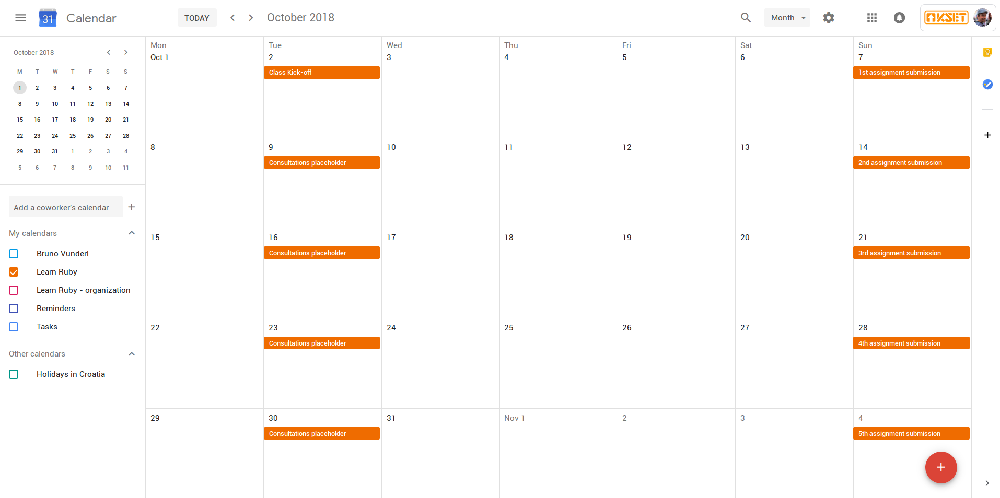
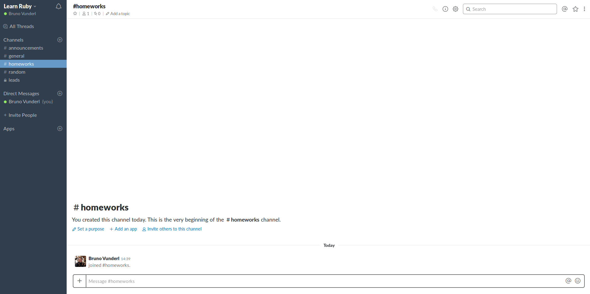

# Class communication

To help you organize your time and remove stress of asking questions multiple
communication channels were established. Our warm advice would be to subscribe
and/or join them now if you already haven't.

## Class calendar

Calendar will be populated with dates of all consultations, homework due dates
and other important dates. 

You can view it and add it to your calendars via this [link](https://calendar.google.com/calendar/b/1?cid=a3NldC5vcmdfOWgxYnI5cGhwbmtxcmFsN3VmZHNwcDU0NWtAZ3JvdXAuY2FsZW5kYXIuZ29vZ2xlLmNvbQ)

## Mail group

All pupils and teaching staff will be added as members of mailing group
ruby@kset.org. Group will be used for accouncements from teaching staff. Group
members will have automatic access to calendar.

If you are attending the class and aren't receivng mails from the group please
contact teaching staff.

## Slack Channel

Slack will be used for asynchronous communication. To join it, you can use your
@kset email address or in case you don't have ask teaching staff to invite you
to the Slack.

There are 4 default channels:
1. announcements - accouncement from teaching staff
2. general - general discussion
3. homeworks - if you encounter solving assignments, ask for help here 
4. random - have an interesting article/podcast/tutorial/meme, share it here

